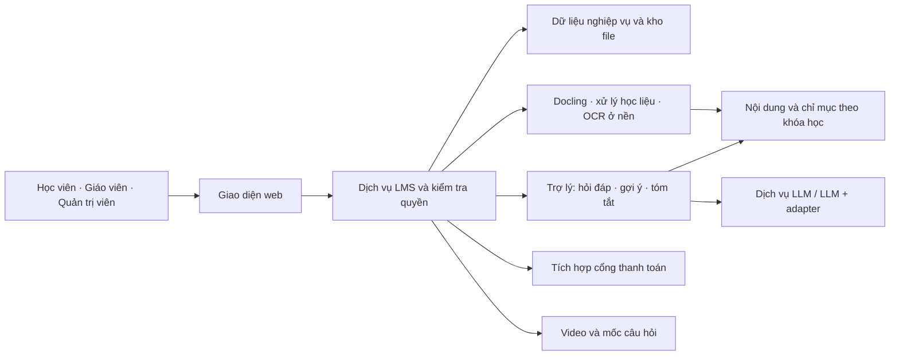
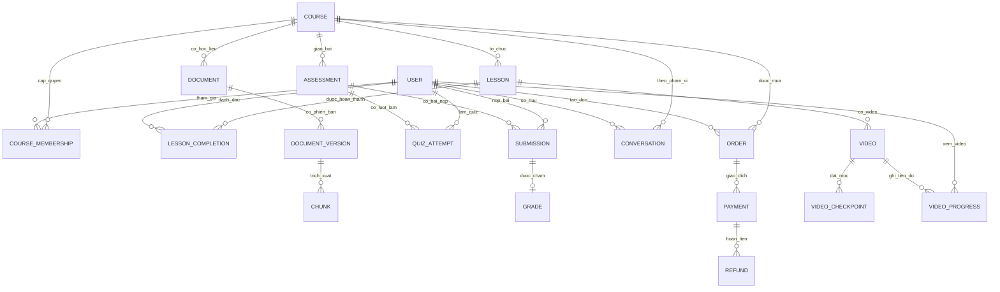

# Đặc tả yêu cầu phần mềm (SRS)

## Hệ thống quản lý học tập thông minh tích hợp LLM tinh chỉnh và RAG

| Thông tin | Nội dung |
|---|---|
| Đề tài | Xây dựng hệ thống quản lý học tập thông minh tích hợp mô hình ngôn ngữ lớn tinh chỉnh và kỹ thuật RAG. |
| Tên dự án | Smart LMS RAG. |
| Sinh viên biên soạn | Trần Tuấn Cường — phần việc B: SRS và MVP. |
| Thành viên nhóm | Vũ Nam Dương, Trần Tuấn Cường. |
| Phiên bản | 1.1. |
| Ngày lập | 02/10/2026. |
| Trạng thái | Bản đặc tả phục vụ triển khai và rà soát với giảng viên. |

## 1. Giới thiệu

### 1.1. Mục đích

Trong đồ án này, nhóm xây dựng một hệ thống LMS để giáo viên tổ chức khóa học và học liệu, đồng thời hỗ trợ học viên thông qua trợ lý AI. Trợ lý sử dụng tài liệu của từng khóa học để hỏi đáp, gợi ý làm bài và tóm tắt nội dung có nguồn đối chiếu. Phần nghiên cứu đánh giá ảnh hưởng của RAG và việc tinh chỉnh mô hình bằng QLoRA đối với chất lượng trợ lý học tập.

Em lập tài liệu SRS để xác định hành vi hệ thống cần thực hiện, quy tắc nghiệp vụ, dữ liệu cần quản lý, chất lượng mong đợi và cách nghiệm thu. Tài liệu là căn cứ chung để nhóm thiết kế, phân chia việc triển khai và xây dựng kiểm thử; giảng viên có thể dùng để đối chiếu phạm vi với kết quả đồ án.

### 1.2. Phạm vi và cách sử dụng

SRS phiên bản 1.1 đặc tả toàn bộ sản phẩm mà nhóm dự kiến hoàn thành và triển khai trong phạm vi đồ án: nghiệp vụ LMS, xử lý học liệu và ba chế độ trợ lý AI theo khóa học. MVP là giai đoạn triển khai đầu tiên để kiểm chứng luồng cốt lõi; chức năng làm sau MVP nhưng thuộc sản phẩm cuối vẫn phải có yêu cầu và tiêu chí nghiệm thu. Các đầu ra nghiên cứu được thực hiện trong công cụ hoặc notebook riêng, phục vụ báo cáo và tích hợp cấu hình đã chọn vào sản phẩm.

Các chức năng, kiểm soát quyền và trạng thái trong tài liệu là yêu cầu cần triển khai. Mục tiêu định lượng là căn cứ lập kế hoạch đánh giá và cần được kiểm chứng. Việc hoàn thành SRS không xác nhận các chức năng hoặc mô hình đã được nghiệm thu.

### 1.3. Tài liệu phân tích liên quan

| Tài liệu | Vai trò |
|---|---|
| [Actors và use cases](srs/actors-usecases.md) | Phân tích tác nhân, nhu cầu và các phương án nghiệp vụ ban đầu. |
| [Yêu cầu chức năng và phi chức năng](srs/requirements.md) | Danh mục yêu cầu tổng thể và cơ sở kiểm chứng. |
| [Phạm vi MVP](srs/mvp-scope.md) | Các chức năng đã chọn, giới hạn của nguyên mẫu và mục tiêu nghiệm thu. |
| [Dataset card](dataset-card.md) | Mô tả corpus hiện có và thông tin sử dụng dữ liệu. |
| [QA pilot](../data/qa/qa_pilot_v1.0.csv) | Bộ câu hỏi, đáp án và vị trí nguồn phục vụ rà soát ban đầu. |

Mã FR, NFR, UC, BR và MVP được giữ thống nhất với các tài liệu phân tích. SRS xác định yêu cầu của sản phẩm cuối, còn tài liệu MVP xác định phần được triển khai trước và giới hạn của giai đoạn đó. Chức năng ngoài MVP được phân biệt với chức năng ngoài đồ án; việc một chức năng chưa triển khai không tự làm thay đổi phạm vi đã cam kết.

### 1.4. Thuật ngữ và quy ước

| Thuật ngữ | Ý nghĩa trong đồ án |
|---|---|
| LMS | Hệ thống quản lý khóa học, học liệu và hoạt động học tập. |
| LLM | Mô hình ngôn ngữ tạo phản hồi cho trợ lý. |
| RAG | Truy xuất bằng chứng từ học liệu và sử dụng bằng chứng khi sinh câu trả lời. |
| QLoRA | Phương pháp tinh chỉnh tham số adapter trên mô hình nền được lượng tử hóa, dùng trong phần nghiên cứu. |
| Corpus | Tập tài liệu được chuẩn bị để xử lý, lập chỉ mục và đánh giá. |
| Chunk | Đoạn nội dung trích xuất có định danh và thông tin nguồn. |
| Citation | Tham chiếu tới tài liệu, phiên bản và vị trí hỗ trợ nội dung trả lời. |
| Development | Tập mẫu dùng để chọn cấu hình và hiệu chỉnh rubric trước đánh giá cuối. |
| Test | Tập đánh giá độc lập; nhãn không được dùng để huấn luyện hoặc chọn cấu hình. |
| Đáp án được bảo vệ | Đáp án, rubric riêng hoặc lời giải chưa công bố mà học viên không có quyền truy cập. |
| FR / FR-R / NFR | Yêu cầu chức năng sản phẩm / yêu cầu nghiên cứu / yêu cầu phi chức năng. |
| P0 / P1 | Thứ tự triển khai: luồng tích hợp cốt lõi / các chức năng hoàn thiện. Giai đoạn MVP hoặc sau MVP được ghi riêng, không suy ra chỉ từ mức ưu tiên. |

## 2. Mô tả tổng thể

### 2.1. Bài toán và quy trình sử dụng

Học viên cần tìm thông tin trong nhiều tài liệu, hiểu những nội dung khó và nhận hướng dẫn khi làm bài. Giáo viên cần tổ chức học liệu, quản lý lớp, giao bài và theo dõi kết quả. Hệ thống kết hợp các nghiệp vụ này trong một khóa học có kiểm soát quyền, để trợ lý AI sử dụng đúng tài liệu và người học kiểm tra được nguồn.

Quy trình chính gồm: quản trị viên cấp tài khoản → giáo viên tạo khóa học, bài học, cấp quyền và tải học liệu → hệ thống xử lý tài liệu → học viên học bài, hỏi đáp, nhận gợi ý hoặc tóm tắt → học viên làm quiz/nộp bài → giáo viên chấm tự luận, công bố kết quả và theo dõi tiến độ.

### 2.2. Ranh giới hệ thống

Sản phẩm gồm giao diện web, dịch vụ nghiệp vụ LMS, cơ sở dữ liệu, kho file, tiến trình xử lý tài liệu, kho truy xuất và dịch vụ sinh phản hồi AI. Các thành phần LLM, embedding, retrieval và reranker là thành phần bên trong hệ thống, không phải actor độc lập của sản phẩm.

Sơ đồ thể hiện trách nhiệm và luồng dữ liệu ở mức yêu cầu. Việc chọn framework, cơ sở dữ liệu vector và cách bố trí tiến trình được thực hiện ở thiết kế kỹ thuật; lựa chọn đó phải bảo toàn quyền theo khóa học và các hợp đồng giao tiếp tại mục 9.

### 2.3. Môi trường và điều kiện áp dụng

- Người dùng sử dụng trình duyệt web hỗ trợ tiếng Việt; nhóm kiểm thử các luồng chính trên Chrome/Edge và ghi phiên bản đã dùng.
- LMS, dữ liệu tài khoản, khóa học, bài nộp, điểm và file cần có lưu trữ bền vững trong môi trường demo.
- GPU T4 của Google Colab Free là môi trường dự kiến cho dry-run, huấn luyện QLoRA và đánh giá. Môi trường inference kết nối với web cần được xác định và thử từ giai đoạn tích hợp đầu tiên.
- Chức năng LMS không phụ thuộc AI vẫn phải hoạt động khi dịch vụ model bị ngắt. Phạm vi nguyên mẫu không đặt yêu cầu vận hành liên tục 24/7.
- Tài liệu đưa vào demo cần được rà soát quyền sử dụng, chất lượng trích xuất và nguồn. Dataset card hiện nêu mục đích nghiên cứu/học tập; thông tin này cần được đối chiếu cho từng tài liệu trước khi quyết định phạm vi sử dụng.
- Thêm học liệu cập nhật chỉ mục RAG, không yêu cầu huấn luyện lại mô hình cho từng khóa học.

## 3. Phạm vi sản phẩm cuối và giai đoạn MVP

### 3.1. Sản phẩm cần hoàn thành trong đồ án

| Nhóm | Chức năng của sản phẩm cuối |
|---|---|
| Học viên | Đăng ký/đăng nhập/đăng xuất, tìm và tham gia khóa học theo điều kiện; học bài và video tương tác; dùng trợ lý, xem lịch sử cá nhân; làm quiz/nộp bài; xem điểm, tiến độ và giao dịch. |
| Giáo viên | Quản lý khóa học công khai/riêng tư, miễn phí/có phí; bài học, tài liệu, video/mốc câu hỏi, thành viên, chính sách AI, bài đánh giá; chấm tự luận, theo dõi lớp và doanh thu cá nhân. |
| Quản trị viên | Quản lý tài khoản/vai trò, vận hành, dashboard nền tảng và thông tin giao dịch/doanh thu theo quyền. |
| Học liệu và AI | Nhận PDF/DOCX/PPTX/TXT, OCR PDF quét khi cần; hỏi đáp/gợi ý/tóm tắt có nguồn; nguồn tổng quát được lựa chọn riêng, không giả làm bằng chứng học liệu. |
| Nghiên cứu | Quản lý corpus/QA/instruction, huấn luyện QLoRA và so sánh Base LLM, RAG, QLoRA+RAG; đánh giá và phân tích lỗi. |

Sản phẩm cuối có **40 yêu cầu chức năng sản phẩm**, **4 đầu ra nghiên cứu** và **32 yêu cầu phi chức năng**. Đây là phạm vi cam kết của đồ án; chưa triển khai một chức năng chỉ là trạng thái tiến độ.

### 3.2. Phân chia giai đoạn triển khai

| Nhóm | MVP triển khai trước | Hoàn thiện sau MVP, bắt buộc bản cuối |
|---|---|---|
| Tài khoản/khóa học | Admin cấp tài khoản, giáo viên cấp quyền lớp | Đăng ký, tìm khóa công khai, lớp có mã/mật khẩu, khóa có phí. |
| Học liệu | PDF có lớp văn bản, ingestion và nguồn trang PDF | DOCX/PPTX/TXT, PDF quét/OCR, nguồn slide/mục/đoạn. |
| Trợ lý | Hỏi đáp/gợi ý/tóm tắt trong phiên, theo học liệu | Lịch sử hội thoại cá nhân; lựa chọn nguồn tổng quát riêng trong hỏi đáp. |
| Học và đánh giá | Bài học, quiz, tự luận/file, điểm và tiến độ lớp | Video tương tác, mốc câu hỏi và gợi ý/xem lại đoạn liên quan. |
| Quản trị/thống kê | Tài khoản/vai trò, vận hành và thống kê lớp | Dashboard nền tảng; thanh toán, lịch sử giao dịch và doanh thu. |
| Nghiên cứu | Thực hiện song song từ sớm | Hoàn thành adapter, benchmark, so sánh và tái lập trước nghiệm thu cuối. |

MVP giữ 32 yêu cầu sản phẩm đã chọn, với giới hạn giai đoạn đầu. FR-05, FR-07, FR-25, FR-33, FR-X01–FR-X04 và phần mở rộng của học liệu/tham gia lớp/video được thực hiện sau MVP. Chức năng làm sau MVP vẫn phải được kiểm thử và nghiệm thu trước bàn giao sản phẩm cuối; các mục tiêu nghiên cứu không phải vai trò hoặc chức năng giao diện LMS.

### 3.3. Ngoài phạm vi đồ án

Không cam kết xây hệ multi-agent tự điều phối, chấm tự luận chính thức bằng AI, dự báo/cá nhân hóa học tập nâng cao hoặc nền tảng streaming/CDN tự phát triển. Điểm tự luận do giáo viên chấm. Video tương tác được triển khai ở mức player và mốc câu hỏi của LMS; lựa chọn nơi lưu/phục vụ video thuộc thiết kế triển khai.

Định dạng DOC/PPT nhị phân cũ và các định dạng chưa nằm trong danh sách hỗ trợ không được cam kết xử lý trực tiếp; có thể chuẩn hóa trước upload. Tóm tắt vẫn giới hạn một tài liệu/phạm vi được chọn theo ngân sách nguồn, không cam kết tóm tắt toàn khóa học không giới hạn. Không đặt SLA 24/7 hoặc bảo đảm loại bỏ hoàn toàn mọi câu trả lời sai.

## 4. Actors và quyền truy cập

### 4.1. Actors

| Mã | Tác nhân | Vai trò trong phạm vi đã chọn |
|---|---|---|
| A-01 | Người chưa đăng nhập | Tìm khóa công khai, đăng ký học viên hoặc đăng nhập; chưa có quyền học liệu hoặc AI. |
| A-02 | Học viên | Học trong lớp được cấp quyền, thực hiện bài đánh giá và xem dữ liệu cá nhân. |
| A-03 | Giáo viên | Quản lý khóa học phụ trách, học liệu, thành viên và kết quả lớp. |
| A-04 | Quản trị viên | Quản lý tài khoản/vai trò và vận hành theo quyền được cấp. |
| X-01 | Cổng thanh toán | Tác nhân ngoài hệ thống nhận giao dịch và cung cấp kết quả được xác thực; không phải vai trò đăng nhập LMS. |

### 4.2. Ma trận quyền

| Hành động | Học viên | Giáo viên | Quản trị viên |
|---|---|---|---|
| Đọc bài học/học liệu, xem video, mở citation | Lớp được cấp quyền và nội dung đã công bố | Lớp phụ trách | Chỉ khi có quyền nội dung tương ứng |
| Tạo/sửa lớp, bài học, tài liệu | Không | Lớp phụ trách | Chỉ khi có quyền nghiệp vụ tương ứng |
| Cấp/thu hồi quyền thành viên | Không | Lớp phụ trách | Chỉ khi có quyền nghiệp vụ tương ứng |
| Dùng trợ lý | Học liệu được phép trong lớp | Dùng theo vai trò học viên nếu được cấp quyền | Dùng theo vai trò học viên nếu được cấp quyền |
| Tạo bài đánh giá/chấm tự luận | Không | Lớp phụ trách | Chỉ khi có quyền nghiệp vụ tương ứng |
| Làm quiz/nộp bài | Bài được giao trong lớp được cấp quyền | Theo vai trò học viên nếu có | Theo vai trò học viên nếu có |
| Xem điểm và bài nộp | Của bản thân, kết quả đã công bố | Lớp phụ trách | Chỉ khi có quyền nghiệp vụ tương ứng |
| Xem thống kê lớp | Không | Lớp phụ trách | Chỉ khi có quyền nghiệp vụ tương ứng |
| Xem/xóa lịch sử trợ lý | Hội thoại của bản thân; nội dung theo quyền hiện tại | Hội thoại của bản thân theo quyền học viên nếu có | Không tự được đọc hội thoại cá nhân |
| Thanh toán/xem giao dịch | Đơn và giao dịch của bản thân | Giao dịch/doanh thu khóa phụ trách | Theo quyền tài chính được cấp |
| Xem dashboard | Học tập của bản thân | Khóa phụ trách | Tổng hợp theo quyền quản trị |
| Quản lý tài khoản/vai trò | Không | Không | Theo quyền quản trị |
| Xem vận hành/cấu hình hạn mức | Không | Trạng thái tài liệu lớp phụ trách | Theo quyền vận hành |

Quyền quản trị tài khoản không tự cấp quyền đọc toàn bộ học liệu, đáp án hoặc hội thoại. Khách chỉ xem giới thiệu công khai, đăng ký và đăng nhập; các thao tác nội dung riêng trong bảng cần xác thực. Backend kiểm tra quyền đối với API, file, citation, retrieval và cache; thay ID trên client không làm thay đổi quyền.

### 4.3. Danh mục use cases của sản phẩm cuối

| Mã | Use case của sản phẩm | Actor chính | Yêu cầu |
|---|---|---|---|
| UC-02 | Đăng nhập và đăng xuất | A-01, A-02, A-03, A-04 | FR-01–FR-02 |
| UC-03 | Quản lý tài khoản và vai trò | A-04 | FR-03–FR-04, FR-36 |
| UC-04 | Tạo và quản lý khóa học | A-03 | FR-06 |
| UC-06 | Tham gia khóa học theo điều kiện | A-02, A-03 | FR-08–FR-09, FR-X01 |
| UC-07 | Quản lý thành viên khóa học | A-03 | FR-09, FR-36 |
| UC-08 | Tạo và quản lý bài học | A-03 | FR-10 |
| UC-09 | Học bài và theo dõi tiến độ | A-02 | FR-11 |
| UC-10 | Tải lên và quản lý tài liệu khóa học | A-03 | FR-12–FR-13, FR-16, FR-36 |
| UC-11 | Theo dõi xử lý tài liệu và yêu cầu thử lại | A-03 | FR-14–FR-16, FR-34 |
| UC-12 | Xem học liệu và mở nguồn trích dẫn | A-02, A-03 | FR-17, FR-21 |
| UC-13 | Hỏi đáp học liệu khóa học | A-02 | FR-18–FR-21 |
| UC-14 | Nhận gợi ý làm bài | A-02 | FR-18, FR-20–FR-22 |
| UC-15 | Tóm tắt học liệu | A-02 | FR-18, FR-21, FR-24 |
| UC-17 | Thiết lập phạm vi học liệu và chính sách trợ lý | A-03 | FR-18, FR-23, FR-36 |
| UC-18 | Tạo và quản lý quiz/bài tập | A-03 | FR-26 |
| UC-19 | Làm quiz và nhận kết quả | A-02 | FR-27–FR-28 |
| UC-20 | Nộp bài tập | A-02 | FR-29 |
| UC-21 | Chấm bài và phản hồi | A-03 | FR-30, FR-36 |
| UC-22 | Xem điểm và phản hồi cá nhân | A-02 | FR-31 |
| UC-23 | Xem thống kê học tập của khóa học | A-03 | FR-32 |
| UC-25 | Giám sát dịch vụ AI và kiểm soát sử dụng | A-04 | FR-34–FR-36 |
| UC-01 | Đăng ký học viên | A-01 | FR-05 |
| UC-05 | Tìm và xem giới thiệu khóa học | A-01, A-02 | FR-07 |
| UC-16 | Xem lại và tiếp tục lịch sử trợ lý | A-02 | FR-25 |
| UC-24 | Xem dashboard nền tảng | A-04 | FR-33 |
| UC-X01 | Thanh toán để tham gia khóa học | A-02, X-01 | FR-X01, FR-08 |
| UC-X02 | Xem giao dịch và doanh thu | A-02, A-03, A-04 | FR-X02, FR-33 |
| UC-X03 | Học qua video tương tác | A-02, A-03 | FR-X03, FR-11, FR-22 |
| UC-X04 | Hỏi đáp với nguồn tổng quát được chọn riêng | A-02 | FR-X04, FR-20 |

UC-01–UC-25 và UC-X01–UC-X04 là use cases của sản phẩm cuối. Mã UC-X được giữ để truy vết nhóm chức năng triển khai sau MVP; không có nghĩa tùy chọn. RES-01–RES-04 tại mục 12.5 là hoạt động nghiên cứu, không đưa vào sơ đồ actors/use cases LMS.

## 5. Quy tắc nghiệp vụ

| Mã | Quy tắc áp dụng cho sản phẩm |
|---|---|
| BR-01 | Kiểm tra tài khoản, vai trò, quyền khóa học và đối tượng tại backend; mặc định từ chối nếu không xác định được quyền. |
| BR-02 | Trong nguồn học liệu, cả ba chế độ AI chỉ dùng tài liệu được phép; lịch sử/cache chịu quyền hiện tại. Nguồn tổng quát là lựa chọn riêng của hỏi đáp, ghi nhãn và không được truy cập nội dung ngoài quyền. |
| BR-03 | Chỉ phiên bản sẵn sàng và đang phục vụ mới được truy xuất. Gỡ ngừng phục vụ ngay; thay thế giữ bản cũ hợp lệ đến khi bản mới sẵn sàng; retry không tạo chunk trùng. |
| BR-04 | Citation phải xác định tài liệu, phiên bản và trang thực, kèm mục nguồn. Không tạo tên tài liệu, số trang hoặc tên chương/mục không có căn cứ. |
| BR-05 | Câu hỏi mơ hồ được yêu cầu làm rõ; thiếu bằng chứng thì thông báo giới hạn; học viên có thể chủ động chọn nguồn tổng quát riêng, không được giả làm câu trả lời có căn cứ học liệu. |
| BR-06 | Gợi ý tuân thủ chính sách và trạng thái bài tại server. Đáp án/rubric riêng không được đưa vào chỉ mục, context hoặc phản hồi của học viên. |
| BR-07 | Tóm tắt phải kiểm tra toàn bộ phạm vi yêu cầu; nêu phạm vi thực tế và phần thiếu khi tác vụ không hoàn thành. Không dùng vài chunk top-k để thay cho nội dung toàn phạm vi. |
| BR-08 | Server kiểm soát hạn, thời lượng và số lượt. Quiz một lượt/học viên; tự luận một lượt nộp, không nộp muộn/nộp lại. Điểm và đáp án hiển thị theo chính sách công bố. |
| BR-09 | Học viên xem dữ liệu cá nhân trong lớp còn quyền; giáo viên xem lớp phụ trách. Thu hồi quyền không xóa điểm/bài nộp; học viên mất quyền truy cập lớp và kết quả qua giao diện lớp. |
| BR-10 | Thêm/thay học liệu cập nhật chỉ mục; QLoRA được huấn luyện trong quy trình nghiên cứu riêng. Không dùng bài nộp hoặc hội thoại học viên để fine-tune mặc định. |
| BR-11 | Corpus, split, model, adapter, prompt và cấu hình đánh giá có phiên bản để truy vết. Không dùng nhãn test để huấn luyện hoặc chọn cấu hình. |
| BR-12 | AI/worker lỗi phải có trạng thái và thông báo đúng; retry khi phù hợp, có timeout và không làm ngừng nghiệp vụ LMS độc lập. |
| BR-13 | Điều kiện lớp và phí được kiểm tra phía server; callback được xác thực, xử lý lặp nhất quán và chỉ cấp quyền/ghi doanh thu một lần. |
| BR-14 | Video/mốc theo quyền và phiên bản; tua, tải lại hoặc sự kiện trùng không tạo tiến độ/hoàn thành sai; đáp án riêng không trả trước công bố. |
| BR-15 | Lịch sử thuộc học viên, kiểm tra quyền hiện hành khi xem/tiếp tục; xóa theo chính sách, không cấp quyền đọc hội thoại cho giáo viên/admin mặc định. |
| BR-16 | Nguồn tổng quát cần lựa chọn riêng và ghi nhãn, không gắn citation học liệu giả hoặc bỏ qua chính sách bài tập. |

### 5.1. Quy tắc khóa học và tiến độ

Khóa học có trạng thái nháp, đang mở và lưu trữ. Nháp chỉ phục vụ quản lý của giáo viên phụ trách; đang mở cho phép học viên có quyền sử dụng nội dung đã công bố; lưu trữ ngừng hoạt động học/AI mới và giữ dữ liệu để giáo viên quản lý. Giáo viên có thể cấp quyền cho tài khoản học viên đang hoạt động; cấp lặp không tạo quan hệ trùng, thu hồi có hiệu lực với lần truy cập tiếp theo và được kiểm tra lại trước khi trả kết quả AI đang xử lý.

Học viên đánh dấu hoàn thành bài học. Tiến độ được tính bằng số bài đã đánh dấu hoàn thành trên tổng bài đã công bố trong khóa học tại thời điểm xem; nếu chưa có bài công bố thì hiển thị chưa có dữ liệu. Việc mở trang hoặc tải lại không tự tăng tiến độ. Khi thêm bài công bố, mẫu số được cập nhật; tiến độ phản ánh trạng thái hoàn thành, không đo mức thông thạo kiến thức.

### 5.2. Quy tắc bài đánh giá và trợ giúp

Quiz dùng câu hỏi một lựa chọn đúng, tự chấm trên server theo phiên bản đề. Thời điểm kết thúc lượt làm là thời điểm sớm hơn giữa hạn chung và thời điểm bắt đầu cộng thời lượng quiz. Khi hết thời gian, hệ thống chốt các câu trả lời đã lưu; gửi lại cùng lượt không tạo thêm điểm. Đề đã có lượt làm không được sửa trực tiếp; muốn sửa cần tạo bài/phiên bản mới và giữ kết quả cũ.

Bài tự luận nhận văn bản hoặc một file PDF/PNG/JPEG trong hạn, tối đa 20 MiB/file. Giáo viên chấm thang 0–10, nhận xét và công bố; điểm chưa chấm/chưa công bố có trạng thái riêng. Quiz có thể hiển thị điểm sau khi chốt lượt; đáp án/lời giải chỉ hiển thị khi giáo viên công bố. Sửa điểm phải có dấu vết.

| Loại tình huống | Mức trợ giúp AI |
|---|---|
| Bài luyện tập | Gợi nhắc khái niệm, đặt câu hỏi dẫn dắt hoặc gợi ý bước tiếp theo; không mặc định giải toàn bộ. |
| Quiz đang làm | Tắt trợ giúp AI theo bài; kiểm tra trạng thái từ backend. |
| Tự luận có chấm điểm | Giáo viên chọn tắt trợ giúp hoặc chỉ gợi ý khái niệm; hết hạn không tự mở lời giải. |
| Đề do học viên nhập, không xác định được chính sách | Yêu cầu làm rõ khi cần; chỉ hỗ trợ trong mức giới hạn, không tự coi là được cung cấp toàn bộ lời giải. |

Kiểm soát không chỉ dựa vào prompt: backend quản lý quyền dữ liệu và chính sách, pipeline loại nguồn riêng, đầu ra được kiểm tra và chấm trên bộ tình huống. Nhóm đánh giá riêng lỗi truy cập đáp án bảo vệ và trường hợp mô hình tự suy luận ra lời giải. Khả năng nhận diện một đề bị sao chép sang câu hỏi độc lập được ghi nhận trong phân tích giới hạn của trợ lý.

### 5.3. Điều kiện tham gia và thanh toán

Vòng đời nháp/đang mở/lưu trữ độc lập với loại công khai/riêng tư và miễn phí/có phí. MVP dùng lớp được giáo viên cấp quyền; bản cuối áp dụng các tổ hợp sau:

| Loại khóa học | Điều kiện tham gia trong bản cuối |
|---|---|
| Công khai, miễn phí | Tài khoản học viên hoạt động chọn tham gia khóa đang mở. |
| Riêng tư, miễn phí | Xác thực mã lớp/mật khẩu hoặc được giáo viên cấp quyền theo chính sách lớp. |
| Công khai, có phí | Giao dịch thành công được server xác thực cho đúng học viên/khóa học. |
| Riêng tư, có phí | Xác thực điều kiện lớp riêng tư và giao dịch thành công; thanh toán không tự vượt điều kiện lớp. |

Mật khẩu lớp không lưu rõ hoặc công bố trong danh sách khóa học. Giá, đơn vị tiền, khóa học và chủ thể đơn được xác định phía server; không dùng giá hoặc trạng thái thành công do client tự gửi. Cấp quyền thủ công cho lớp có phí chỉ thực hiện khi người có quyền cho phép miễn phí theo chính sách và phải ghi dấu vết, không tạo giao dịch/doanh thu giả.

Mỗi đơn lưu giá tại lúc tạo và liên kết giao dịch của cổng thanh toán; thay giá khóa học không sửa đơn đã tạo. Callback hoặc đối soát phải được xác thực và xử lý lặp nhất quán; trình duyệt quay về từ cổng thanh toán chưa đủ chứng minh thành công. Khi hoàn tiền đã được xác nhận toàn bộ, quyền do giao dịch đó cấp được thu hồi theo chính sách, nhưng không xóa điểm/bài nộp. Hoàn tiền một phần được ghi số tiền thực đã xác nhận và chính sách quyền; không tự coi là hoàn toàn.

### 5.4. Video, lịch sử và lựa chọn nguồn trả lời

Video tương tác thuộc bài học và giữ cùng quyền khóa học. Giáo viên đặt thời điểm câu hỏi và đoạn xem lại trong thời lượng video. Player dừng ở mốc; câu trả lời được server kiểm tra. Sai có thể xem gợi ý được phép hoặc quay lại đoạn liên quan; mốc video không mặc định là một bài quiz chấm điểm chính thức. Nếu liên kết bài có chấm điểm, quy tắc thời gian/công bố/trợ giúp của bài đó vẫn áp dụng.

Tiến độ xem và trạng thái trả lời mốc được lưu riêng, gắn phiên bản video. Tua qua mốc không tự đánh dấu đã trả lời; phát lại, tải lại hoặc gửi sự kiện trùng không nhân đôi tiến độ. Việc hoàn thành bài vẫn được hiển thị theo tiêu chí bài đã cấu hình và không được diễn giải là chứng minh thông thạo.

Lịch sử AI của bản cuối được lưu theo học viên/khóa học và hỗ trợ xem, tiếp tục, xóa. Mở/tiếp tục kiểm tra lại quyền, trạng thái nguồn và chính sách; hội thoại liên quan lớp đã mất quyền không trả nội dung qua lịch sử. Giáo viên/admin không có quyền đọc toàn bộ hội thoại chỉ vì quản lý lớp hoặc tài khoản.

Nguồn học liệu là mặc định của hỏi đáp. Khi học viên chủ động chọn nguồn tổng quát, giao diện và phản hồi phải ghi rõ nội dung chưa được xác nhận bằng học liệu; không tạo citation tài liệu giả. Nguồn tổng quát không được dùng để bỏ qua giới hạn trợ giúp bài có chấm điểm hoặc lấy đáp án riêng. Hai nhóm nguồn được đánh giá riêng trong báo cáo AI.

## 6. Yêu cầu chức năng

### 6.1. Yêu cầu chức năng của sản phẩm cuối

Mỗi yêu cầu cần đạt trong bản cuối; cột giai đoạn xác định phần làm trước. Các giới hạn MVP chỉ áp dụng giai đoạn MVP và được ghi riêng trong `mvp-scope.md`.

| Mã | Yêu cầu | Tiêu chí chấp nhận của sản phẩm cuối | Use case | Ưu tiên | Giai đoạn |
|---|---|---|---|---|---|
| FR-01 | Hệ thống phải cho phép tài khoản đang hoạt động đăng nhập bằng thông tin xác thực hợp lệ. | Đăng nhập đúng tạo phiên gắn tài khoản và vai trò; thông tin sai hoặc tài khoản bị khóa không tạo phiên. | UC-02 | P0 | MVP |
| FR-02 | Hệ thống phải cho phép đăng xuất và kết thúc hiệu lực phiên tương ứng. | Sau đăng xuất, sử dụng lại phiên đã kết thúc để gọi API được bảo vệ phải bị từ chối; phiên hết hạn yêu cầu xác thực lại. | UC-02 | P0 | MVP |
| FR-03 | Quản trị viên phải có thể tạo, cập nhật và khóa/mở khóa tài khoản theo quyền quản trị. | Thay đổi được lưu; tài khoản bị khóa không tiếp tục thực hiện yêu cầu được bảo vệ; định danh tài khoản trùng bị từ chối. | UC-03 | P0 | MVP |
| FR-04 | Hệ thống phải cho phép quản trị viên được cấp quyền quản lý vai trò của tài khoản. | Học viên không thể tự nâng quyền; thay đổi vai trò ảnh hưởng đến các yêu cầu tiếp theo. Thao tác làm mất tài khoản quản trị hoạt động cuối cùng phải được ngăn chặn trong cơ chế cấp quyền được chọn. | UC-03 | P0 | MVP |
| FR-05 | Hệ thống phải cho khách đăng ký tài khoản học viên. | Kiểm tra dữ liệu bắt buộc và định danh trùng; mật khẩu lưu bằng cơ chế băm. Tài khoản mới chỉ có vai trò học viên, chưa có quyền khóa học; không tự cấp giáo viên/admin. | UC-01 | P1 | Sau MVP — bắt buộc bản cuối |
| FR-06 | Giáo viên phải có thể tạo và chỉnh sửa thông tin khóa học do mình quản lý. | Giáo viên tạo/sửa khóa học phụ trách với tên, mô tả, trạng thái, loại công khai/riêng tư và miễn phí/có phí; khóa có phí lưu giá hợp lệ phía server. Không được sửa bằng cách thay ID lớp của người khác. | UC-04 | P0 | MVP; hoàn thiện bản cuối |
| FR-07 | Hệ thống phải cung cấp danh sách và chức năng tìm thông tin giới thiệu của khóa học công khai. | Tìm theo tên/từ khóa, xem giới thiệu và điều kiện tham gia các khóa đang mở, được công khai. Không công bố nội dung học liệu, đáp án hoặc lớp riêng tư qua kết quả tìm kiếm. | UC-05 | P1 | Sau MVP — bắt buộc bản cuối |
| FR-08 | Hệ thống phải cấp quyền học khi đáp ứng điều kiện tham gia của khóa học. | MVP dùng giáo viên cấp quyền. Bản cuối hỗ trợ lớp công khai miễn phí tự tham gia, lớp riêng tư xác thực mã/mật khẩu và khóa có phí yêu cầu giao dịch thành công được xác thực. Cấp quyền lặp không tạo bản ghi trùng; các điều kiện riêng tư và có phí phải cùng thỏa mãn khi áp dụng. | UC-06 | P0 | MVP; hoàn thiện bản cuối |
| FR-09 | Giáo viên phải có thể xem và quản lý thành viên trong khóa học phụ trách. | Cấp/thu hồi quyền theo cơ chế tham gia đã chọn; thay đổi có hiệu lực với truy cập tiếp theo và không tự xóa điểm/lượt nộp đã có. | UC-07 | P1 | MVP |
| FR-10 | Giáo viên phải có thể tạo, chỉnh sửa, sắp xếp và liên kết học liệu với bài học. | Giáo viên tạo/sửa bài học văn bản, sắp xếp và liên kết tài liệu/bài đánh giá trong cùng khóa học. Học viên chỉ thấy bài đã công bố; liên kết ngoài quyền bị từ chối. | UC-08 | P1 | MVP |
| FR-11 | Hệ thống phải ghi và hiển thị tiến độ học của từng học viên. | Lưu đánh dấu hoàn thành bài theo học viên/bài học; hiển thị tiến độ trên nội dung đã công bố. Với video tương tác, lưu riêng các mốc đã trả lời và tiến độ xem; tải lại/tua/gửi sự kiện lặp không nhân đôi tiến độ hoặc tự chứng minh đã học xong. | UC-09 | P1 | MVP; hoàn thiện bản cuối |
| FR-12 | Giáo viên phải có thể tải tài liệu vào khóa học được quản lý. | Kiểm tra quyền, loại file thực tế và giới hạn trước lưu. MVP nhận PDF văn bản; bản cuối nhận PDF, DOCX, PPTX, TXT và PDF quét có thể OCR. Lưu người tải, lớp, file và phiên bản; file chưa xử lý không được báo sẵn sàng. | UC-10 | P0 | MVP; hoàn thiện bản cuối |
| FR-13 | Hệ thống phải quản lý việc thay thế và gỡ tài liệu theo phiên bản. | Thay thế tạo phiên bản mới, giữ bản cũ hợp lệ đến khi bản mới sẵn sàng. Gỡ ngừng phục vụ retrieval/mở nguồn ngay; kết quả tác vụ cũ không khôi phục bản đã gỡ. | UC-10 | P0 | MVP |
| FR-14 | Hệ thống phải xử lý tài liệu ở nền và hiển thị trạng thái cho giáo viên. | Xử lý nền sau tiếp nhận upload; có trạng thái chờ, đang xử lý, sẵn sàng, lỗi và đã gỡ. Chỉ sẵn sàng khi trích xuất, chia đoạn, lưu vị trí, tạo chỉ mục và kiểm tra nội dung hoàn tất. | UC-11 | P0 | MVP |
| FR-15 | Giáo viên phải có thể yêu cầu thử lại tác vụ xử lý tài liệu bị lỗi. | Lưu nguyên nhân và kết quả lần thử; thử lại không tạo chunk/chỉ mục trùng hoặc phục vụ sai phiên bản. File đã gỡ không tự xuất hiện lại vì một tác vụ cũ kết thúc. | UC-11 | P0 | MVP |
| FR-16 | Pipeline phải trích xuất, chuẩn hóa và chia đoạn học liệu thuộc các định dạng đã chọn. | Bản cuối dùng Docling cho PDF/DOCX/PPTX và OCR PDF quét khi cần; TXT được chuẩn hóa bằng bộ đọc văn bản phù hợp. Mỗi chunk có lớp/tài liệu/phiên bản và vị trí thực: trang PDF, slide PPTX hoặc mục/đoạn DOCX/TXT. Kết quả thiếu nội dung/OCR không đáp ứng kiểm tra chất lượng phải báo lỗi hoặc yêu cầu bản rõ hơn, không âm thầm bỏ phần lỗi. | UC-10–UC-11 | P0 | MVP; hoàn thiện bản cuối |
| FR-17 | Người có quyền phải có thể xem học liệu và mở vị trí được trích dẫn. | Mở học liệu hoặc vị trí được trích dẫn theo quyền và phiên bản hiện hành. Hiển thị tên nguồn và trang/slide/mục/đoạn thực; cung cấp chỉ dẫn vị trí nếu viewer không nhảy trực tiếp. Không mở nguồn đã gỡ hoặc ngoài quyền qua link cũ. | UC-12 | P0 | MVP; hoàn thiện bản cuối |
| FR-18 | Mỗi yêu cầu trợ lý phải được xác định phạm vi khóa học và học liệu theo quyền hiện tại của người gửi. | Backend xác định quyền lớp/học liệu và chính sách theo tài khoản hiện hành. Mọi nhánh retrieval, tóm tắt, ngữ cảnh, lịch sử và cache loại dữ liệu ngoài quyền/đáp án riêng; kiểm tra lại trước khi trả. Nhánh kiến thức tổng quát được tách riêng, không đọc học liệu ngoài quyền. | UC-13–UC-17, UC-X04 | P0 | MVP; hoàn thiện bản cuối |
| FR-19 | Học viên phải có thể hỏi đáp nội dung trong học liệu khóa học. | Hệ thống nhận câu hỏi, truy xuất bằng chứng và trả câu trả lời theo phạm vi được chọn; lưu/hiển thị trạng thái xử lý khi yêu cầu chưa hoàn thành. | UC-13 | P0 | MVP |
| FR-20 | Trợ lý phải có nhánh xử lý câu hỏi mơ hồ, thiếu bằng chứng hoặc ngoài phạm vi học liệu. | Trong chế độ học liệu, câu hỏi mơ hồ yêu cầu làm rõ, thiếu nguồn thông báo giới hạn. Nếu học viên chọn nguồn kiến thức tổng quát theo FR-X04 thì ghi nhãn riêng; không tự fallback mà trình bày câu trả lời như đã được học liệu chứng minh. | UC-13–UC-14 | P0 | MVP; hoàn thiện bản cuối |
| FR-21 | Câu trả lời sử dụng học liệu phải có thông tin trích dẫn tương ứng. | Câu trả lời dùng học liệu hiển thị tên tài liệu, phiên bản, vị trí trang/slide/mục/đoạn và tham chiếu nguồn. Citation thuộc bằng chứng hợp lệ, đúng quyền; không gán trang PDF cho DOCX khi không có bản phân trang. Nguồn hỗ trợ nhận định được đánh giá riêng ở NFR-29. | UC-12–UC-15 | P0 | MVP; hoàn thiện bản cuối |
| FR-22 | Trợ lý phải cung cấp gợi ý làm bài theo mức trợ giúp được phép. | Học viên có thể nhận gợi nhắc khái niệm/bước tiếp theo theo chính sách bài hoặc mốc video. Lấy trạng thái từ backend, loại đáp án riêng; bài đang thi/tắt trợ giúp được xử lý theo chính sách, không tự coi là được giải toàn bộ. | UC-14, UC-X03 | P1 | MVP; hoàn thiện bản cuối |
| FR-23 | Giáo viên phải có thể thiết lập học liệu được sử dụng và chính sách trợ giúp của trợ lý trong khóa học. | Cấu hình phân biệt tài liệu học viên và tài liệu riêng/đáp án; lưu chính sách có phiên bản, áp dụng trong các yêu cầu tiếp theo; không cho phép cấu hình bỏ qua quyền nền tảng. | UC-17 | P1 | MVP |
| FR-24 | Học viên phải có thể yêu cầu tóm tắt tài liệu hoặc phạm vi nội dung được chọn. | Tóm tắt một tài liệu hoặc phạm vi trang/slide/mục được chọn. MVP dùng PDF; bản cuối áp dụng các định dạng được hỗ trợ, tối đa 10.000 token nguồn và 20 trang/slide khi định dạng có đơn vị đó. Kiểm tra quyền/độ bao phủ, gắn nguồn; vượt giới hạn yêu cầu thu hẹp, ngắt thì báo phần thiếu. | UC-15 | P1 | MVP; hoàn thiện bản cuối |
| FR-25 | Hệ thống phải cho học viên lưu, xem lại và tiếp tục hội thoại cá nhân. | Hội thoại/lượt trao đổi gắn học viên và khóa học, được giữ sau restart; học viên có thể xóa lịch sử của mình. Khi mở/tiếp tục phải kiểm tra quyền hiện tại; lớp mất quyền hoặc nguồn đã gỡ không được trả lại từ lịch sử/cache. Giáo viên/admin không mặc định đọc toàn bộ hội thoại. | UC-16 | P1 | Sau MVP — bắt buộc bản cuối |
| FR-26 | Giáo viên phải có thể tạo và quản lý quiz/bài tập trong khóa học phụ trách. | Lưu quiz một lựa chọn đúng hoặc tự luận/nộp file, đề, hạn/thời lượng, chính sách trợ giúp và công bố. Đáp án/rubric riêng tách khỏi dữ liệu học viên; đề đã có lượt làm giữ nguyên phiên bản. | UC-18 | P1 | MVP |
| FR-27 | Hệ thống phải kiểm tra điều kiện và quản lý lượt làm quiz. | Mỗi học viên một lượt quiz, chỉ bắt đầu khi có quyền và còn thời gian. Lượt gắn phiên bản đề; server kiểm soát hạn/thời lượng và chốt câu trả lời đã lưu khi hết thời gian. | UC-19 | P1 | MVP |
| FR-28 | Hệ thống phải nhận bài quiz và tự chấm theo đáp án của phiên bản đề tương ứng. | Lưu câu trả lời/điểm nhất quán; yêu cầu nộp lặp không tạo điểm khác nhau cho cùng lượt; chỉ trả kết quả/đáp án theo thời điểm được công bố. | UC-19 | P1 | MVP |
| FR-29 | Học viên phải có thể nộp bài tự luận hoặc file cho bài tập được giao. | Nhận một lượt nộp bằng văn bản hoặc một file PDF/PNG/JPEG tối đa 20 MiB trong hạn. Lưu người nộp, phiên bản bài và thời điểm server; không nhận nộp muộn/nộp lại, gửi lặp cùng thao tác không tạo bản ghi trùng. | UC-20 | P1 | MVP |
| FR-30 | Giáo viên phải có thể chấm và phản hồi bài nộp trong lớp phụ trách. | Giáo viên lớp phụ trách chấm tự luận thang 0–10, ghi nhận xét, lưu và công bố. Sửa điểm có dấu vết; AI không quyết định điểm chính thức. | UC-21 | P1 | MVP |
| FR-31 | Học viên phải có thể xem điểm và phản hồi cá nhân đã được công bố. | Chỉ hiển thị kết quả của đúng học viên; chưa chấm/chưa công bố có trạng thái riêng; không dùng điểm 0 để thay cho kết quả còn thiếu. | UC-22 | P1 | MVP |
| FR-32 | Giáo viên phải có thể xem thống kê tiến độ và kết quả trong khóa học phụ trách. | Có phạm vi và thời điểm tính; số liệu khớp dữ liệu học/lượt nộp/điểm; học viên chưa có điểm được phân biệt với điểm 0. | UC-23 | P1 | MVP |
| FR-33 | Quản trị viên phải có thể xem thống kê sử dụng nền tảng ở mức tổng hợp. | Dashboard hiển thị người dùng, khóa học, hoạt động và giao dịch/doanh thu theo định nghĩa thống nhất. Có phạm vi/thời điểm tính, phân biệt chờ/thất bại/hoàn tiền; quyền tổng hợp không tự cho đọc nội dung riêng. | UC-24, UC-X02 | P1 | Sau MVP — bắt buộc bản cuối |
| FR-34 | Người được cấp quyền vận hành phải có thể theo dõi tình trạng xử lý tài liệu và dịch vụ AI. | Người có quyền vận hành xem trạng thái, loại lỗi và thời gian xử lý AI/ingestion; người dùng có thông báo tương ứng. AI ngắt không báo sẵn sàng; không yêu cầu dashboard tổng hợp toàn nền tảng. | UC-11, UC-25 | P1 | MVP |
| FR-35 | Hệ thống phải hỗ trợ cấu hình và thực thi hạn mức sử dụng AI. | Thực thi quota 20 yêu cầu AI/giờ/học viên, một lượt sinh đồng thời, tối đa 5 tác vụ chờ và timeout theo loại tác vụ. Vượt quota/hàng đợi không gọi model tiếp; không ảnh hưởng quyền đọc bài. | UC-25 | P1 | MVP |
| FR-36 | Hệ thống phải ghi dấu vết các thay đổi quản trị và nghiệp vụ có ảnh hưởng tới quyền hoặc kết quả học tập. | Ghi người thao tác, đối tượng, thời điểm và loại thay đổi cho cấp/thu hồi quyền, gỡ tài liệu, chỉnh chính sách và sửa điểm; chỉ người có quyền đọc được dấu vết. | UC-03, UC-07, UC-10, UC-17, UC-21, UC-25 | P1 | MVP |
| FR-X01 | Hệ thống phải hỗ trợ thanh toán để tham gia khóa học có phí. | Server tạo đơn với giá/điều kiện khóa học đã kiểm tra; xác thực thông báo hoặc đối soát với cổng thanh toán. Chỉ cấp quyền khi giao dịch thành công và đủ điều kiện lớp; callback/gửi lại không cấp quyền hoặc ghi doanh thu nhiều lần. Chờ/thất bại/hủy/hết hạn không cấp quyền; demo kiểm chứng trong sandbox. | UC-X01 | P1 | Sau MVP — bắt buộc bản cuối |
| FR-X02 | Hệ thống phải cung cấp lịch sử giao dịch và thống kê doanh thu theo vai trò. | Học viên xem giao dịch cá nhân, giáo viên xem khóa học phụ trách và admin xem tổng hợp theo quyền. Doanh thu là số tiền giao dịch thành công trừ khoản hoàn tiền đã xác nhận, ghi đơn vị tiền/phạm vi/thời điểm. Hoàn tiền có bằng chứng đối soát và dấu vết; không xóa giao dịch cũ. | UC-X02 | P1 | Sau MVP — bắt buộc bản cuối |
| FR-X03 | Hệ thống phải hỗ trợ video có câu hỏi tại các mốc thời gian. | Giáo viên quản lý video và mốc hỏi trong bài học; player dừng tại mốc, nhận câu trả lời rồi cho tiếp tục theo cấu hình. Trả lời sai có thể nhận gợi ý được phép hoặc quay lại đoạn đã chỉ định. Mốc/sự kiện gắn học viên và phiên bản, tua/tải lại không tăng tiến độ sai; không để đáp án riêng trong dữ liệu player. | UC-X03 | P1 | Sau MVP — bắt buộc bản cuối |
| FR-X04 | Trợ lý phải hỗ trợ lựa chọn nguồn kiến thức tổng quát riêng trong chế độ hỏi đáp. | Mặc định dùng học liệu. Khi thiếu nguồn, học viên có thể chủ động chọn nguồn tổng quát; phản hồi ghi chưa được xác nhận bằng học liệu, không có citation khóa học giả. Tất cả chính sách bài tập, quyền và quota vẫn áp dụng; không dùng lựa chọn này để lấy đáp án riêng. | UC-X04 | P1 | Sau MVP — bắt buộc bản cuối |

### 6.2. Yêu cầu nghiên cứu

Các yêu cầu này là đầu ra cần hoàn thành của đồ án, thực hiện qua notebook/công cụ nghiên cứu. Không xây giao diện huấn luyện dành cho giáo viên hoặc học viên.

| Mã | Yêu cầu | Tiêu chí chấp nhận | Hoạt động nghiên cứu |
|---|---|---|---|
| FR-R01 | Bộ công cụ nghiên cứu phải hỗ trợ quản lý corpus và QA benchmark có phiên bản. | Mỗi mẫu có câu hỏi, đáp án hoặc hành vi mong đợi, định danh nguồn/vị trí khi có, loại tình huống và split; có manifest, quyền sử dụng và kết quả rà soát dữ liệu. | RES-01 |
| FR-R02 | Quy trình huấn luyện phải tạo và lưu adapter QLoRA từ dữ liệu instruction được kiểm soát. | Có dry-run, cấu hình, checkpoint, log và model/adapter card; tách dữ liệu huấn luyện khỏi nhãn test; ghi lại lỗi OOM/ngắt phiên và điểm tiếp tục nếu có. | RES-02 |
| FR-R03 | Bộ công cụ đánh giá phải chạy và lưu kết quả so sánh Base LLM, RAG và QLoRA+RAG. | Dùng cùng QA và protocol; lưu câu trả lời, context, citation, cấu hình, latency và metric từng mẫu; hỗ trợ khảo sát retrieval dense/hybrid/rerank khi được chọn, ghi nhận lượt lỗi. | RES-03 |
| FR-R04 | Quy trình đánh giá phải hỗ trợ kiểm tra thủ công và phân tích lỗi. | Có rubric và bộ mẫu được chấm; phân loại lỗi truy xuất, sinh câu trả lời, nguồn, từ chối và gợi ý; số liệu báo cáo truy ngược tới kết quả đã lưu. | RES-04 |

QLoRA cần có ít nhất một lượt huấn luyện adapter hoàn chỉnh, cùng checkpoint, cấu hình và log. Nhóm báo cáo kết quả cả khi adapter không cải thiện chất lượng; việc chọn cấu hình phục vụ căn cứ tập development và tài nguyên, không thay đổi nhãn test để tạo kết quả tốt hơn.

## 7. Đặc tả các luồng trọng yếu

Các use case còn lại thực hiện theo yêu cầu và tiêu chí chấp nhận tại mục 6. Các luồng dưới đây mô tả chi tiết những điểm tích hợp và nhánh lỗi cần kiểm thử sớm.

### 7.1. UC-03 — Quản lý tài khoản và vai trò

- **Actor:** quản trị viên.
- **Tiền điều kiện:** phiên hợp lệ và có quyền quản lý tài khoản/vai trò trong phạm vi được cấp.
- **Kích hoạt:** tạo tài khoản hoặc chọn tài khoản cần cập nhật.
- **Luồng chính:** nhập thông tin → kiểm tra định danh và quyền → lưu tài khoản, trạng thái hoặc vai trò → ghi dấu vết → trả kết quả.
- **Ngoại lệ:** định danh trùng, dữ liệu thiếu hoặc quyền không đủ bị từ chối; thao tác khóa/hạ quyền quản trị viên hoạt động cuối cùng bị chặn. Khi khóa tài khoản, các yêu cầu được bảo vệ tiếp theo bị từ chối.
- **Hậu điều kiện:** thay đổi được lưu nhất quán; không cấp quyền nội dung lớp chỉ vì có quyền quản trị tài khoản.

### 7.2. UC-04, UC-06, UC-07 — Tạo lớp và cấp quyền

- **Actor:** giáo viên; học viên mở lớp sau khi được cấp quyền.
- **Tiền điều kiện:** giáo viên có vai trò phù hợp; khi sửa/cấp quyền phải phụ trách đúng khóa học; học viên có tài khoản hoạt động.
- **Kích hoạt:** giáo viên tạo/sửa khóa học hoặc quản lý thành viên.
- **Luồng chính:** lưu tên, mô tả và trạng thái lớp → tạo/sắp xếp bài học → chọn học viên có sẵn và cấp quyền → công bố nội dung → học viên đăng nhập và mở lớp trong danh sách được cấp.
- **Ngoại lệ:** sai quyền, tài khoản không hợp lệ hoặc nội dung chưa công bố thì từ chối tương ứng. Cấp quyền lặp giữ một quan hệ. Thu hồi quyền giữ điểm/bài nộp nhưng chặn truy cập tiếp theo; kết quả AI đang chạy được kiểm tra lại quyền trước khi trả.
- **Hậu điều kiện:** thành viên chỉ truy cập nội dung hợp lệ trong lớp được cấp.

### 7.3. UC-10, UC-11 — Upload, xử lý và thay/gỡ học liệu

- **Actor:** giáo viên.
- **Tiền điều kiện:** có quyền lớp; tài liệu được rà soát quyền sử dụng và đáp ứng giới hạn đầu vào.
- **Kích hoạt:** upload học liệu mới, thay file, gỡ tài liệu hoặc retry tác vụ lỗi.
- **Luồng chính:**
  1. Kiểm tra quyền, loại file thực tế, kích thước và giới hạn định dạng; MVP dùng PDF văn bản, bản cuối thêm DOCX/PPTX/TXT và OCR PDF quét.
  2. Lưu file cùng metadata/phiên bản, tạo tác vụ và trả trạng thái tiếp nhận.
  3. Worker dùng Docling cho PDF/DOCX/PPTX, OCR PDF quét khi cần và bộ đọc cho TXT; kiểm tra nội dung, chia đoạn và giữ vị trí trang/slide/mục/đoạn.
  4. Tạo embedding/chỉ mục, kiểm tra tính nhất quán và chuyển sẵn sàng.
  5. Khi thay thế, chuyển sang bản mới sau khi bản mới sẵn sàng; nguồn cũ ngừng phục vụ.
- **Ngoại lệ:** file hỏng, định dạng không hỗ trợ, OCR/trích xuất thiếu nội dung hoặc không đạt kiểm tra chất lượng, timeout hoặc worker ngắt chuyển lỗi/báo giới hạn; không báo đủ toàn tài liệu nếu bỏ trang lỗi. Retry không tạo chunk trùng. Gỡ ngừng phục vụ ngay; tác vụ đang chạy không được phục hồi bản đã gỡ.
- **Hậu điều kiện:** chỉ phiên bản sẵn sàng, đang phục vụ và được công bố mới có thể vào context học viên.

### 7.4. UC-13 — Hỏi đáp học liệu

- **Actor:** học viên.
- **Tiền điều kiện:** phiên hợp lệ, quyền lớp hiện hành; câu hỏi và phạm vi hợp lệ, dịch vụ AI khả dụng để xử lý.
- **Kích hoạt:** chọn chế độ hỏi đáp trong khóa học và gửi câu hỏi.
- **Luồng chính:**
  1. Backend kiểm tra tài khoản, quyền, quota và khả năng tiếp nhận tác vụ.
  2. Xác định học liệu được phép theo trạng thái và phiên bản hiện hành.
  3. Truy xuất bằng chứng trong phạm vi đó; fusion/rerank theo cấu hình đã chọn.
  4. Xác định đủ bằng chứng và tạo phản hồi sử dụng context hợp lệ.
  5. Kiểm tra lại quyền, phiên bản và các tham chiếu; trả câu trả lời cùng nguồn đối chiếu.
- **Thay thế/ngoại lệ:** mơ hồ thì hỏi lại; thiếu nguồn/ngoài học liệu thì thông báo giới hạn; nguồn đang xử lý thì báo trạng thái; AI ngắt hoặc timeout thì báo lỗi có thể thử lại; quyền/nguồn thay đổi thì hủy kết quả không còn hợp lệ và cho gửi lại khi phù hợp.
- **Hậu điều kiện:** có câu trả lời kèm nguồn hoặc phản hồi giới hạn/lỗi rõ ràng; không trả context ngoài quyền. Citation tồn tại được kiểm tra ở runtime; mức nguồn hỗ trợ nội dung được đánh giá riêng.

### 7.5. UC-14, UC-17 — Gợi ý theo chính sách bài tập

- **Actor:** học viên yêu cầu gợi ý; giáo viên thiết lập chính sách.
- **Tiền điều kiện:** học viên có quyền lớp/bài; giáo viên chỉ sửa chính sách của lớp phụ trách.
- **Kích hoạt:** học viên mở bài hoặc nhập đề và cách làm trong chế độ gợi ý.
- **Luồng chính:** lấy chính sách/trạng thái bài từ server → kiểm tra mức trợ giúp → yêu cầu bổ sung nếu thiếu đề/cách làm → truy xuất kiến thức được phép → gợi nhắc khái niệm, đặt câu hỏi hoặc chỉ bước tiếp theo → kiểm tra đầu ra và nguồn → trả phản hồi.
- **Ngoại lệ:** quiz đang làm/tắt trợ giúp thì từ chối hỗ trợ theo bài; yêu cầu bỏ qua chính sách không nâng mức trợ giúp; đáp án/rubric riêng bị loại khỏi truy xuất. Không xác định được bài/chính sách thì áp dụng mức giới hạn, yêu cầu làm rõ khi cần.
- **Hậu điều kiện:** học viên nhận trợ giúp trong phạm vi cho phép; trợ lý không nộp bài hoặc quyết định điểm chính thức.

### 7.6. UC-15 — Tóm tắt học liệu

- **Actor:** học viên.
- **Tiền điều kiện:** có quyền trên toàn bộ tài liệu/khoảng trang; nguồn sẵn sàng, đang phục vụ.
- **Kích hoạt:** chọn một tài liệu hoặc phạm vi trang/slide/mục và yêu cầu tóm tắt; MVP dùng PDF.
- **Luồng chính:** kiểm tra số trang/token nguồn trước chia phần → xác định toàn bộ nội dung phạm vi → chia thành các phần phù hợp context → tóm tắt từng phần → tổng hợp ý chính, nguồn và phạm vi → kiểm tra quyền/phiên bản và trả kết quả.
- **Ngoại lệ:** vượt 20 trang/slide đối với định dạng có đơn vị đó hoặc 10.000 token nguồn thì yêu cầu thu hẹp; phần nguồn lỗi, timeout hoặc dịch vụ ngắt phải báo phần chưa hoàn thành. Không lấy top-k của hỏi đáp để đại diện cho toàn phạm vi; quyền/phiên bản thay đổi được xử lý như UC-13.
- **Hậu điều kiện:** bản tóm tắt nêu được phạm vi và có nguồn; bản một phần không được trình bày như đã bao phủ toàn bộ.

### 7.7. UC-18, UC-19 — Tạo và làm quiz

- **Actor:** giáo viên tạo đề; học viên làm quiz.
- **Tiền điều kiện:** giáo viên phụ trách lớp; học viên được giao bài, còn hạn và chưa sử dụng lượt làm.
- **Kích hoạt:** giáo viên công bố quiz; học viên chọn bắt đầu.
- **Luồng chính:** lưu phiên bản đề và đáp án riêng → tạo một lượt làm → trả câu hỏi không kèm đáp án → lưu lựa chọn của học viên → nhận nộp hoặc chốt khi hết thời gian → tự chấm trên server → lưu điểm và hiển thị phần được phép công bố.
- **Ngoại lệ:** sai quyền, hết hạn hoặc đã có lượt làm thì không tạo lượt mới. Khi mất kết nối, chỉ câu trả lời đã được server xác nhận lưu có thể dùng để chấm. Nộp lặp trả kết quả nhất quán; sửa đề đã có lượt làm cần bài/phiên bản mới.
- **Hậu điều kiện:** lượt làm, câu trả lời và điểm gắn đúng học viên/phiên bản; đáp án chỉ hiển thị khi được công bố.

### 7.8. UC-20, UC-21, UC-22 — Nộp và chấm tự luận

- **Actor:** học viên nộp/xem kết quả; giáo viên chấm.
- **Tiền điều kiện:** học viên có quyền bài và còn hạn; giáo viên có quyền lớp và bài nộp tồn tại.
- **Kích hoạt:** nộp văn bản/file hoặc mở bài cần chấm.
- **Luồng chính:** kiểm tra quyền, hạn và file → lưu một lượt nộp cùng thời điểm server → xác nhận đã nhận → giáo viên đọc bài, nhập điểm 0–10 và nhận xét → lưu/công bố → học viên xem kết quả cá nhân.
- **Ngoại lệ:** file sai loại/vượt giới hạn, nộp muộn hoặc nộp lại bị từ chối; gửi lại cùng thao tác đã nhận không tạo lượt mới. Điểm ngoài thang và truy cập bài người khác bị chặn; sửa điểm được ghi dấu vết.
- **Hậu điều kiện:** bài nộp được giữ để chấm; chưa chấm/chưa công bố có trạng thái riêng; file nộp không vào chỉ mục RAG.

### 7.9. UC-23, UC-25 — Thống kê lớp và vận hành

- **Actor:** giáo viên xem lớp; quản trị viên/người được cấp quyền vận hành xem dịch vụ.
- **Tiền điều kiện:** có quyền đối với phạm vi thống kê hoặc thông tin vận hành.
- **Kích hoạt:** mở kết quả lớp, trạng thái tác vụ hoặc cấu hình hạn mức.
- **Luồng chính:** kiểm tra quyền → tổng hợp tiến độ/lượt nộp/điểm hoặc lấy trạng thái AI/ingestion → hiển thị phạm vi và thời điểm cập nhật; thay cấu hình theo quyền và ghi dấu vết.
- **Ngoại lệ:** chưa có điểm hiển thị trạng thái, không tự tính là 0; AI ngắt hiển thị không khả dụng; quyền vận hành không cho phép đọc toàn văn hội thoại/đáp án riêng.
- **Hậu điều kiện:** dữ liệu phản ánh đúng phạm vi; giới hạn áp dụng ở backend và không làm mất chức năng học độc lập với AI.

### 7.10. UC-01, UC-05, UC-06 — Đăng ký, tìm và tham gia lớp

- **Actor:** khách, học viên.
- **Tiền điều kiện:** chức năng đăng ký/tìm kiếm bản cuối khả dụng; tham gia cần tài khoản hoạt động và lớp đang mở.
- **Luồng chính:** khách đăng ký tài khoản học viên hoặc đăng nhập → tìm khóa công khai/xem giới thiệu → chọn tham gia → server kiểm tra điều kiện riêng tư/phí theo mục 5.3 → tạo quyền hợp lệ hoặc chuyển sang thanh toán.
- **Ngoại lệ:** định danh trùng, mã/mật khẩu sai, lớp đóng hoặc điều kiện phí chưa đủ thì không cấp quyền. Tìm kiếm không trả học liệu riêng; tự đăng ký không nâng vai trò.
- **Hậu điều kiện:** học viên chỉ đọc nội dung sau khi đã có quyền; thao tác tham gia lặp nhất quán.

### 7.11. UC-16, UC-24 — Lịch sử cá nhân và dashboard

- **Actor:** học viên xem hội thoại; admin xem dashboard theo quyền.
- **Luồng lịch sử:** liệt kê hội thoại cá nhân → kiểm tra quyền lớp và nguồn hiện hành → mở/tiếp tục hoặc xóa hội thoại. Mất quyền không được xem lại nội dung lớp; không mở lịch sử người khác.
- **Luồng dashboard:** kiểm tra quyền → tổng hợp người dùng/khóa học/hoạt động/giao dịch → hiển thị định nghĩa, thời điểm và phạm vi số liệu. Tổng hợp không tạo quyền đọc nội dung riêng; lỗi/thiếu dữ liệu có trạng thái riêng.
- **Hậu điều kiện:** lịch sử tồn tại sau restart nhưng chịu quyền hiện tại; số liệu tổng hợp khớp dữ liệu gốc.

### 7.12. UC-X01, UC-X02 — Thanh toán, giao dịch và doanh thu

- **Actor:** học viên, cổng thanh toán; giáo viên/admin xem số liệu theo quyền.
- **Tiền điều kiện:** học viên hoạt động, khóa đang mở và điều kiện lớp được kiểm tra; kết nối cổng thanh toán được cấu hình theo môi trường.
- **Luồng chính:** server tạo đơn từ giá khóa học → khởi tạo giao dịch → học viên thao tác tại cổng → hệ thống nhận thông báo/đối soát được xác thực → kiểm tra số tiền, đơn và chủ thể → lưu thành công và cấp quyền một lần → hiển thị giao dịch/doanh thu theo vai trò.
- **Ngoại lệ:** thông báo sai xác thực/sai tiền/sai đơn bị từ chối và không cấp quyền; chờ/thất bại/hủy/hết hạn có trạng thái riêng; callback lặp hoặc đến không đúng thứ tự không ghi doanh thu/cấp quyền trùng. Đối soát xử lý trường hợp chưa nhận thông báo.
- **Hoàn tiền:** ghi bằng chứng xác nhận và số tiền hoàn; điều chỉnh doanh thu/quyền theo chính sách, giữ lịch sử và dấu vết.
- **Hậu điều kiện:** đơn/giao dịch và quyền nhất quán; học viên không sửa trạng thái hoặc xem giao dịch người khác. Demo tích hợp dùng sandbox, giao diện phân biệt sandbox với môi trường giao dịch thật.

### 7.13. UC-X03 — Video tương tác

- **Actor:** giáo viên, học viên.
- **Tiền điều kiện:** giáo viên quản lý bài học/video; học viên có quyền nội dung đã công bố.
- **Luồng chính:** giáo viên thêm video và mốc câu hỏi → kiểm tra thời điểm/đoạn xem lại → công bố → học viên phát video → player dừng tại mốc → gửi lựa chọn → server trả phản hồi được phép → tiếp tục hoặc gợi ý/xem lại đoạn → lưu trạng thái mốc/tiến độ.
- **Ngoại lệ:** mốc ngoài thời lượng hoặc sai lớp bị từ chối; mất quyền chặn nguồn video và các yêu cầu tiếp theo; tua/tải lại/gửi lặp không nhân đôi tiến độ; AI ngắt thì báo gợi ý không khả dụng nhưng vẫn cho xem lại đoạn và các hoạt động không cần AI.
- **Hậu điều kiện:** tiến độ gắn đúng học viên/phiên bản video; không lộ đáp án riêng qua dữ liệu player hoặc request giả.

### 7.14. UC-X04 — Hỏi đáp với nguồn tổng quát

- **Actor:** học viên.
- **Tiền điều kiện:** phiên/quota hợp lệ và chính sách trợ giúp cho phép; học viên chủ động chọn nguồn tổng quát trong hỏi đáp.
- **Luồng chính:** kiểm tra quyền/chính sách → tạo phản hồi với nguồn tổng quát → kiểm tra đầu ra → hiển thị nhãn chưa xác nhận bằng học liệu, không gắn citation khóa học giả.
- **Ngoại lệ:** yêu cầu đáp án bảo vệ/bỏ qua chính sách bị xử lý như gợi ý; không tự chuyển nguồn chỉ vì retrieval thất bại. AI lỗi trả trạng thái riêng.
- **Hậu điều kiện:** nguồn trả lời rõ ràng; kết quả được đánh giá tách khỏi hỏi đáp có bằng chứng của RAG.

## 8. Yêu cầu dữ liệu

### 8.1. Các đối tượng dữ liệu chính

Bảng mô tả dữ liệu nghiệp vụ cần có. Tên bảng, kiểu cột và cách lưu được cụ thể hóa ở thiết kế cơ sở dữ liệu.

| Đối tượng | Thông tin tối thiểu | Ràng buộc |
|---|---|---|
| Tài khoản và vai trò | ID, định danh đăng nhập, tên hiển thị, mật khẩu đã băm, trạng thái, vai trò/phạm vi quyền | Định danh không trùng; không tự nâng quyền; giữ quản trị viên hoạt động cuối cùng. |
| Khóa học | ID, tên, mô tả, giáo viên phụ trách, trạng thái, công khai/riêng tư, miễn phí/có phí, giá/đơn vị tiền, mã lớp/mật khẩu đã băm, thời điểm cập nhật | Giáo viên quản lý theo quan hệ sở hữu/phân công; trạng thái quyết định truy cập. |
| Thành viên khóa học | Khóa học, học viên, trạng thái quyền, người cấp/thu hồi, thời điểm | Một quan hệ hiện hành/học viên/khóa học; thu hồi không xóa điểm/lượt nộp. |
| Bài học | ID, khóa học, tiêu đề, nội dung, thứ tự, trạng thái công bố, liên kết học liệu/bài đánh giá | Liên kết cùng phạm vi được phép; tiến độ dựa trên bài đã công bố. |
| Hoàn thành bài học | Học viên, bài học, trạng thái/thời điểm hoàn thành | Không trùng học viên/bài học; tải lại không tự cập nhật. |
| Tài liệu và phiên bản | ID, khóa học, tên hiển thị, phiên bản, file/checksum, người tải, loại file, số trang/slide khi có, cấu hình/kết quả OCR, phạm vi đọc/AI, trạng thái phục vụ | File và chỉ mục phải cùng phiên bản; học liệu học viên tách khỏi nguồn riêng. |
| Chunk | ID, khóa học, tài liệu, phiên bản, văn bản, loại vị trí, trang/slide hoặc section/đoạn, thông tin chỉ mục | Truy được về file/trang; không phục vụ chunk của bản đã gỡ hoặc ngoài quyền. |
| Tác vụ xử lý | ID, loại, đối tượng/phiên bản, người yêu cầu, trạng thái, lần thử, thời gian, mã lỗi/cấu hình | Retry không nhân đôi kết quả; hoàn thành muộn không khôi phục đối tượng đã gỡ. |
| Chính sách trợ lý | Khóa học/bài đánh giá, mức trợ giúp, học liệu được dùng, phiên bản, người sửa | Không mở rộng quyền nền tảng; áp dụng chính sách hiện hành trước trả kết quả. |
| Bài đánh giá và câu hỏi | ID, lớp/bài học, kiểu bài, phiên bản đề, hạn/thời lượng, quy tắc công bố, đáp án/rubric riêng | Đề và đáp án tách quyền; phiên bản đã có lượt làm giữ nguyên. |
| Lượt quiz và câu trả lời | Học viên, bài/phiên bản, thời điểm bắt đầu/kết thúc, trạng thái, lựa chọn đã lưu, điểm | Một lượt/bài/học viên; thời gian do server xác định; nộp/chấm lặp nhất quán. |
| Bài nộp và kết quả tự luận | Học viên, bài/phiên bản, văn bản hoặc file, thời điểm nộp, điểm, nhận xét, người chấm, trạng thái công bố | Một lượt nộp; điểm 0–10; học viên chỉ đọc kết quả cá nhân đã công bố. |
| Dấu vết thay đổi | Người thao tác, hành động, đối tượng, thời điểm, thông tin thay đổi cần thiết | Chỉ người có quyền đọc; ghi cấp/thu hồi quyền, gỡ/thay nguồn, sửa chính sách và điểm. |
| Hội thoại và lượt trao đổi AI | Học viên, khóa học, chế độ/nguồn trả lời, nội dung, citation/phiên bản nguồn, thời điểm, trạng thái xóa | MVP giữ trong phiên; bản cuối lưu lịch sử cá nhân, kiểm tra quyền khi xem/tiếp tục và hỗ trợ xóa. |
| Đơn hàng và giao dịch | Học viên, khóa học, giá tại lúc tạo, đơn vị tiền, ID đơn/giao dịch ngoài, trạng thái, xác thực/đối soát, thời điểm | Giá phía server; callback lặp nhất quán; không tự cấp quyền từ client. |
| Hoàn tiền | Giao dịch gốc, số tiền, căn cứ xác nhận, trạng thái/quyền liên quan, người thao tác, thời điểm | Không vượt số tiền hợp lệ; giữ giao dịch gốc và dấu vết để tính doanh thu. |
| Video và mốc câu hỏi | Bài học, phiên bản video, nguồn/file, thời lượng, thời điểm mốc, câu hỏi/đáp án riêng, đoạn xem lại, chính sách trợ giúp | Mốc trong thời lượng; quyền nguồn media và đáp án tách biệt. |
| Tiến độ video | Học viên, video/phiên bản, phần đã xem, mốc/câu trả lời đã lưu, thời điểm | Sự kiện lặp/tua không tạo hoàn thành hoặc tiến độ sai. |
| Dữ liệu và kết quả nghiên cứu | Corpus/manifest, QA, split, run, model/adapter, prompt, context, phản hồi, citation, metric, latency/lỗi | Có phiên bản; tách nhãn test khỏi huấn luyện; dữ liệu đánh giá được kiểm soát quyền. |

### 8.2. Quan hệ nghiệp vụ

Đây là sơ đồ khái niệm. Quan hệ chủ thể, quyền giáo viên và phiên bản đề vẫn phải được thực thi theo bảng dữ liệu; không suy ra quyền chỉ từ quan hệ trong sơ đồ. Quiz và tự luận dùng những đối tượng lượt làm/nộp tương ứng với kiểu bài.

### 8.3. Trạng thái và chuyển trạng thái

| Đối tượng | Trạng thái/chuyển trạng thái | Điều kiện kiểm soát |
|---|---|---|
| Tài khoản | Hoạt động ↔ bị khóa | Admin có quyền thao tác; khóa ảnh hưởng yêu cầu tiếp theo. |
| Khóa học | Nháp → đang mở → lưu trữ | Mức truy cập tại mục 5.1; khi lưu trữ không tạo hoạt động học/AI mới. |
| Quyền thành viên | Được cấp ↔ đã thu hồi | Giáo viên phụ trách; giữ các dữ liệu học tập đã có. |
| Phiên bản tài liệu | Chờ → đang xử lý → sẵn sàng hoặc lỗi; lỗi → chờ khi retry; bất kỳ bản chưa gỡ → đã gỡ | Đã gỡ không trở lại sẵn sàng do tác vụ cũ. Sẵn sàng chưa đủ nếu bản không còn là bản đang phục vụ. |
| Tác vụ AI | Chờ → đang xử lý → thành công hoặc lỗi/hết hạn/hủy | Quyền, chính sách hoặc nguồn thay đổi có thể hủy; hết hạn không ghi thành công muộn. |
| Quiz | Chưa bắt đầu → đang làm → đã chốt và chấm | Một lượt; hết thời gian chốt theo dữ liệu đã lưu; kết quả/đáp án theo công bố. |
| Tự luận | Chưa nộp → đã nộp/chờ chấm → đã chấm/chưa công bố → đã công bố | Không nộp lại; sửa điểm sau công bố cần dấu vết; chưa có điểm không thay bằng 0. |
| Đơn/giao dịch | Chờ → thành công hoặc thất bại/hủy/hết hạn; thành công → hoàn một phần/toàn bộ khi xác nhận | Thông báo phải xác thực; lặp/đến muộn không ghi đè sai kết quả đã đối soát. |
| Mốc video | Chưa trả lời → đã trả lời; trạng thái gắn phiên bản | Tua không tự chuyển trạng thái; thực hiện lặp không tăng tiến độ. |

### 8.4. Quy tắc vị trí nguồn và lưu trữ

Mỗi chunk/citation có `course_id`, `document_id`, `document_version`, `chunk_id` khi dùng chunk và vị trí nguồn theo định dạng. PDF dùng trang vật lý 1-based, PPTX dùng slide thực 1-based, DOCX dùng tiêu đề/mục và định danh đoạn ổn định, TXT dùng đoạn hoặc khoảng dòng. OCR PDF giữ vị trí trang gốc; không tạo trang DOCX hoặc số slide giả. Nội dung video được chỉ vị trí bằng timestamp khi tham chiếu sự kiện video; không mặc định đưa video vào RAG hoặc coi timestamp là bằng chứng văn bản.

Dữ liệu nghiệp vụ đã xác nhận lưu phải tồn tại sau restart. File bài nộp được lưu để chấm, không tự đưa vào corpus AI. Khi gỡ học liệu, metadata/dấu vết được giữ để truy vết nhưng quyền đọc và retrieval ngừng ngay. Lịch sử cá nhân bản cuối được lưu theo FR-25; log vận hành vẫn mặc định không chứa toàn văn học liệu/hội thoại, mật khẩu hoặc token. Mốc thời gian được lưu với múi giờ rõ ràng và hiển thị cho người dùng Việt Nam theo UTC+7.

## 9. Yêu cầu giao diện và giao tiếp

### 9.1. Giao diện người dùng

| Mã | Nhóm màn hình | Hành vi cần có |
|---|---|---|
| UI-01 | Đăng ký/đăng nhập | Đăng ký học viên hoặc nhập thông tin xác thực; báo lỗi phù hợp; chuyển tới chức năng theo quyền. |
| UI-02 | Học viên — khóa học/bài học | Tìm khóa công khai, nhập điều kiện lớp riêng tư, mở lớp có quyền; đọc các định dạng được hỗ trợ, đánh dấu hoàn thành và xem tiến độ. |
| UI-03 | Học viên — trợ lý | Một giao diện với ba chế độ hỏi đáp/gợi ý/tóm tắt, nguồn học liệu/tổng quát được phân biệt và phạm vi khóa học rõ; nhập câu hỏi hoặc chọn tài liệu/trang; hiển thị trạng thái và nguồn có thể mở. |
| UI-04 | Học viên — bài đánh giá/kết quả | Xem đề được giao, thời gian quiz, lựa chọn câu trả lời, nộp tự luận/file, xác nhận đã nhận và điểm/nhận xét đã công bố. |
| UI-05 | Giáo viên — quản lý lớp | Tạo/sửa lớp và điều kiện công khai/riêng tư, miễn phí/có phí; quản lý bài học, quyền, học liệu, trạng thái OCR/trích xuất và retry. |
| UI-06 | Giáo viên — đánh giá | Tạo quiz/tự luận và chính sách AI; xem bài nộp, chấm/công bố; xem tiến độ và kết quả lớp. |
| UI-07 | Quản trị/vận hành | Quản lý tài khoản/vai trò; dashboard người dùng, lớp, hoạt động/giao dịch; vận hành AI/ingestion và hạn mức theo quyền. |
| UI-08 | Thanh toán/giao dịch | Tạo đơn, chuyển cổng, xem trạng thái được server xác nhận, lịch sử cá nhân và doanh thu theo quyền; ghi rõ sandbox khi demo. |
| UI-09 | Video tương tác | Giáo viên đặt mốc; học viên xem player dừng hỏi, gửi lựa chọn, nhận gợi ý hoặc xem lại đoạn, xem trạng thái mốc/tiến độ. |
| UI-10 | Lịch sử trợ lý | Liệt kê, mở, tiếp tục hoặc xóa hội thoại cá nhân; báo không khả dụng khi mất quyền/nguồn. |

Các màn hình hỗ trợ tiếng Việt có dấu, thao tác chính bằng bàn phím và bố cục sử dụng được ở viewport 360 px/1.280 px. Giao diện phân biệt chưa có dữ liệu, đang xử lý, thiếu bằng chứng, mất quyền, vượt quota và lỗi dịch vụ; không hiển thị lỗi nội bộ hoặc bí mật.

### 9.2. Hợp đồng giao tiếp giữa các thành phần

| Mã | Giao tiếp | Đầu vào tối thiểu | Đầu ra và kiểm soát |
|---|---|---|---|
| IF-01 | Web ↔ xác thực | Thông tin đăng nhập hoặc phiên cần kết thúc | Phiên gắn tài khoản/quyền hoặc lỗi; kết thúc phiên làm mất hiệu lực tương ứng. |
| IF-02 | Web ↔ nghiệp vụ LMS | Phiên, đối tượng lớp/bài, dữ liệu thao tác | Kết quả sau kiểm tra quyền, phiên bản và trạng thái; thay ID không vượt quyền. |
| IF-03 | Web ↔ upload/ingestion | Phiên giáo viên, khóa học, file thuộc danh sách hỗ trợ, metadata/phạm vi | ID tài liệu/phiên bản/tác vụ và trạng thái; upload không chờ toàn bộ ingestion. |
| IF-04 | Web ↔ tác vụ AI | Phiên, khóa học, chế độ, câu hỏi hoặc tài liệu/khoảng trang; ID bài khi gợi ý theo bài | ID/trạng thái tác vụ; kết quả, hành vi phản hồi, citation, phạm vi tóm tắt hoặc mã lỗi. Backend tự xác định quyền và chính sách. |
| IF-05 | Trợ lý ↔ retrieval/kho nội dung | Phạm vi hợp lệ do backend cấp, câu hỏi hoặc phạm vi tóm tắt, cấu hình truy xuất | Văn bản/bằng chứng cùng định danh, phiên bản và vị trí; mọi nhánh/cache giữ bộ lọc quyền. |
| IF-06 | Trợ lý ↔ model service | Chế độ, prompt, context được phép, giới hạn token, ID tác vụ/cấu hình | Nội dung phản hồi, tham chiếu đề xuất, trạng thái/lỗi; model không tự quyết định quyền hoặc truy cập cơ sở dữ liệu LMS. |
| IF-07 | Web ↔ mở file/citation | Phiên và ID tài liệu/phiên bản/vị trí | File/nguồn đúng quyền hiện tại hoặc trạng thái không khả dụng; đường dẫn vật lý không được công bố. |
| IF-08 | Công cụ nghiên cứu ↔ kết quả | QA ID, split, model/adapter, cấu hình và dữ liệu đã đóng phiên bản | Context, câu trả lời, citation, metric, latency và lỗi từng mẫu; tái lập theo protocol. |
| IF-09 | LMS ↔ cổng thanh toán | Đơn server, số tiền/đơn vị, khóa học, ID giao dịch; thông báo/đối soát và dữ liệu xác thực | Trạng thái giao dịch được xác nhận; kiểm tra chữ ký/cơ chế xác thực, idempotency và điều kiện cấp quyền. |
| IF-10 | Web ↔ video/mốc | Phiên, video/phiên bản, mốc, lựa chọn và sự kiện tiến độ | Media và phản hồi theo quyền; mốc/câu trả lời server quản lý, không trả đáp án riêng trước công bố. |
| IF-11 | Web ↔ lịch sử AI | Phiên, ID hội thoại/lượt, thao tác xem/tiếp tục/xóa | Chỉ dữ liệu cá nhân còn quyền; nguồn gỡ/mất quyền không đọc lại qua lịch sử. |
| IF-12 | Web ↔ dashboard/giao dịch | Phiên và phạm vi thống kê/đơn/giao dịch | Tổng hợp hoặc dữ liệu cá nhân theo vai trò, có định nghĩa/thời điểm; không cấp quyền nội dung riêng. |

Đây là hợp đồng ở mức yêu cầu, chưa ấn định URL endpoint, cách polling/streaming, schema API đầy đủ hoặc framework. Thiết kế API phải mô tả những quyết định này và duy trì các dữ liệu/kiểm soát trong bảng.

Một kết quả AI cần phân biệt `answered`, `clarification_required`, `insufficient_evidence` và `policy_blocked` với lỗi kỹ thuật của tác vụ. Citation đi kèm chứa định danh nguồn, tên tài liệu và vị trí trang/slide/mục/đoạn phù hợp. Mục nguồn phải dựa trên các bằng chứng thực đã được phép sử dụng; tham chiếu do model đề xuất được kiểm tra trước khi hiển thị.

### 9.3. Nhóm lỗi cần biểu diễn

| Nhóm lỗi | Hành vi yêu cầu |
|---|---|
| Chưa xác thực/phiên hết hạn | Yêu cầu đăng nhập; không trả dữ liệu được bảo vệ. |
| Không có quyền/nguồn không khả dụng | Từ chối mà không tiết lộ nội dung ngoài quyền; cho biết cần kiểm tra quyền hoặc trạng thái. |
| Đầu vào/file không hợp lệ | Báo trường/phạm vi cần sửa; không tạo tài liệu sẵn sàng hoặc lượt nộp thành công giả. |
| Xung đột phiên bản/trạng thái | Không ghi đè điểm, đề hoặc quyền bằng dữ liệu cũ; yêu cầu tải lại/gửi lại khi phù hợp. |
| Vượt quota/hàng đợi đầy | Báo giới hạn/bận; không khởi tạo thêm lượt model ngoài cấu hình. |
| Model/worker không khả dụng hoặc timeout | Có ID tác vụ, trạng thái cuối và khả năng retry phù hợp; giữ các dữ liệu LMS đã lưu. |

Backend ghi ID yêu cầu/tác vụ để đối chiếu lỗi, còn thông báo cho người dùng không chứa stack trace, token hoặc đường dẫn lưu trữ nội bộ.

## 10. Yêu cầu phi chức năng

Các tiêu chí phân quyền, dữ liệu và trạng thái được kiểm tra bằng tình huống có kết quả xác định. Các ngưỡng hiệu năng/chất lượng AI là mục tiêu kiểm chứng ban đầu của nguyên mẫu; khi thay đổi phải ghi lý do và quyết định trên development trước test cuối. Nghiệm thu phải báo từng tiêu chí đạt hoặc chưa đạt, kèm cấu hình và bằng chứng.

### 10.1. Bảo mật và quyền riêng tư

| Mã | Yêu cầu | Cách kiểm tra và tiêu chí |
|---|---|---|
| NFR-01 | Phân quyền phải áp dụng cho API, file, video, retrieval, lịch sử/cache và giao dịch. | Toàn bộ tình huống sai vai trò/lớp/chủ thể bị chặn, gồm media, hội thoại và đơn/giao dịch. Kiểm tra lại trước trả AI khi quyền thay đổi; quyền dashboard không cho đọc dữ liệu riêng. |
| NFR-02 | Thông tin xác thực và bí mật hệ thống phải được bảo vệ khi lưu, truyền và ghi log. | Mật khẩu dùng cơ chế băm mật khẩu thích hợp, không lưu rõ; token/bí mật không xuất hiện trong repo, phản hồi hoặc log. Truy cập từ xa có xác thực phải dùng kết nối mã hóa; cấu hình cookie/token được rà theo cách triển khai đã chọn. |
| NFR-03 | File tải lên phải được kiểm tra trước khi lưu vào vùng phục vụ hoặc xử lý. | Kiểm tra file sai loại/giả phần mở rộng, hỏng, vượt giới hạn hoặc tên có ý đồ truy cập đường dẫn; DOCX/PPTX phải được kiểm tra trước parse. Không thực thi file như mã; định danh lưu do hệ thống tạo. Video và học liệu tuân giới hạn riêng. |
| NFR-04 | Nội dung câu hỏi và học liệu không được thay đổi quyền hoặc chính sách hệ thống. | Dùng bộ test prompt injection từ câu hỏi và tài liệu; kiểm tra không có quyền bị nâng, không truy xuất khóa học khác và không lộ đáp án riêng. Tỷ lệ tuân thủ nội dung sinh ra được báo cáo riêng theo NFR-31. |
| NFR-05 | Hội thoại, dữ liệu đánh giá và log phải có mục đích/phạm vi lưu và truy cập rõ. | MVP giữ ngữ cảnh phiên; bản cuối lưu lịch sử cá nhân, cho xóa và kiểm tra quyền hiện tại. Log không mặc định ghi toàn văn. Thời hạn lưu/cách xóa, mục đích đánh giá và quyền truy cập được cấu hình, ghi rõ trước triển khai. |
| NFR-06 | Hệ thống phải giới hạn lạm dụng tài nguyên ở các chức năng xác thực, upload và AI. | Gửi yêu cầu vượt cấu hình kiểm thử phải nhận phản hồi giới hạn; không tạo vô hạn tác vụ hoặc hàng đợi. Quota và giới hạn tải lên kiểm tra phía server, không chỉ qua giao diện. |

### 10.2. Hiệu năng và sử dụng tài nguyên

| Mã | Yêu cầu | Cách kiểm tra và tiêu chí |
|---|---|---|
| NFR-07 | API nghiệp vụ LMS phải đáp ứng trong thời gian phù hợp với thao tác web. | Đề xuất p95 không quá 2 giây khi chạy 1.000 yêu cầu với 10 người dùng ảo trên dữ liệu thử nghiệm đã ghi nhận. Không tính truyền file, AI và dịch vụ ngoài; đo riêng từng nhóm endpoint thay vì chỉ lấy trung bình chung. |
| NFR-08 | Thời gian trả lời AI phải được đo và kiểm soát theo cấu hình tài nguyên. | Mục tiêu p95 ≤ 120 giây cho 50 câu hỏi trong phạm vi ở development, một lượt sinh đồng thời, tối đa 4.096 token đầu vào/512 token sinh. Đo retrieval/rerank/generation và thời gian chờ; ghi model, phần cứng, lượng tử hóa, cache, lỗi và timeout. Tóm tắt có phép đo riêng. |
| NFR-09 | Tác vụ ingestion không được giữ kết nối của thao tác tải lên đến khi xử lý hoàn tất. | Sau nhận/lưu file, mục tiêu xác nhận tiếp nhận trong 3 giây; truyền file và xử lý nền đo riêng. Đo theo PDF văn bản, PDF OCR, DOCX, PPTX, TXT; không gộp các loại để che lỗi OCR hoặc thời gian xử lý. |
| NFR-10 | Khối lượng yêu cầu AI phải được giới hạn theo khả năng phục vụ của nguyên mẫu. | Khởi đầu đề xuất một lượt generation đồng thời, tối đa 5 tác vụ chờ; quá giới hạn thì từ chối có thông báo. Chạy toàn bộ bộ pilot trong cấu hình đã chọn, ghi peak RAM/VRAM và số OOM; có lỗi OOM phải điều chỉnh trước khi khóa cấu hình demo. |

### 10.3. Độ tin cậy và phục hồi

| Mã | Yêu cầu | Cách kiểm tra và tiêu chí |
|---|---|---|
| NFR-11 | Lỗi AI phải được cô lập khỏi các nghiệp vụ LMS không phụ thuộc AI. | Tắt dịch vụ AI rồi kiểm tra đăng nhập, mở bài học, xem học liệu và nộp bài vẫn hoạt động; yêu cầu AI nhận trạng thái lỗi phù hợp, không chờ vô hạn. |
| NFR-12 | Thao tác lặp hoặc thử lại không được gây dữ liệu trùng/mâu thuẫn. | Gửi lặp tham gia, ingestion, nộp bài, callback thanh toán và sự kiện video; không tạo quyền/chunk/điểm/doanh thu/tiến độ trùng. Giao dịch sai thứ tự được xử lý theo trạng thái đã xác thực. |
| NFR-13 | Dữ liệu đã xác nhận lưu phải tồn tại sau khi tiến trình ứng dụng khởi động lại. | Sau xác nhận lưu, restart và đối chiếu tài khoản/lớp/file/bài nộp/điểm, lịch sử, giao dịch và tiến độ video. Tác vụ gián đoạn được phát hiện để thử lại/báo lỗi; không kẹt xử lý vô hạn. |
| NFR-14 | Nguyên mẫu phải có quy trình sao lưu và kiểm tra khôi phục dữ liệu cần thiết. | Thử khôi phục DB/file và đối chiếu quyền, điểm, giao dịch, lịch sử, tiến độ video, checksum. Chỉ mục khôi phục hoặc xây lại từ corpus/manifest; checkpoint cần giữ ngoài phiên GPU tạm thời. |

### 10.4. Toàn vẹn và nhất quán dữ liệu

| Mã | Yêu cầu | Cách kiểm tra và tiêu chí |
|---|---|---|
| NFR-15 | Các đối tượng dữ liệu phải có quan hệ hợp lệ và đúng phạm vi sở hữu. | Không tạo bài học, chunk, lượt nộp hoặc điểm tham chiếu đối tượng không tồn tại/sai khóa học. Bản ghi trùng định danh và quan hệ không hợp lệ bị từ chối; thao tác nhiều bước có kết quả nhất quán khi lỗi giữa chừng. |
| NFR-16 | File, metadata, chỉ mục và citation phải nhất quán theo phiên bản phục vụ. | Thử thay/gỡ tài liệu hoặc thu hồi quyền khi truy vấn. Phải dùng phiên bản hợp lệ và kiểm tra lại trước khi trả; nguồn/quyền không còn hợp lệ thì hủy/báo trạng thái thay đổi, không trả nội dung cũ như nguồn hiện hành. |
| NFR-17 | Thời gian và trạng thái bài đánh giá phải được xác định phía server. | Thử đổi giờ client, nộp tại thời điểm hết hạn và sửa đề khi đã có lượt làm; kết quả tuân theo thời gian server và phiên bản đề. Thời điểm lưu có múi giờ rõ, hiển thị cho người dùng Việt Nam theo UTC+7. |

### 10.5. Khả năng sử dụng và tương thích

| Mã | Yêu cầu | Cách kiểm tra và tiêu chí |
|---|---|---|
| NFR-18 | Giao diện và nội dung phải hỗ trợ tiếng Việt có dấu. | Kiểm tra tên khóa học, file, câu hỏi, câu trả lời và kết quả xuất; không lỗi mã hóa, mất dấu hoặc cắt nội dung khiến không đọc được. |
| NFR-19 | Người dùng phải hiểu trạng thái và cách xử lý lỗi của tác vụ. | Các trạng thái chưa có dữ liệu, đang xử lý, thiếu nguồn, hết quyền, vượt quota và lỗi dịch vụ có thông báo riêng; không hiển thị lỗi kỹ thuật/bí mật nội bộ. Có cách thử lại khi phù hợp. |
| NFR-20 | Các luồng chính phải sử dụng được trên màn hình phổ biến và bằng bàn phím. | Kiểm tra viewport 360 px và 1.280 px, cùng các phiên bản Chrome/Edge được ghi trong biên bản; không mất nút hoặc buộc cuộn ngang toàn trang. Dùng bàn phím truy cập được trường nhập, nút gửi và liên kết nguồn, có trạng thái focus rõ. |

### 10.6. Triển khai, bảo trì và kiểm thử

| Mã | Yêu cầu | Cách kiểm tra và tiêu chí |
|---|---|---|
| NFR-21 | Môi trường phải có hướng dẫn cài đặt và cấu hình có thể tái lập. | Cài từ checkout sạch, cấu hình mẫu không chứa bí mật, chạy cả luồng lõi và các tích hợp bản cuối; có đóng gói/hướng dẫn triển khai, cấu hình sandbox/production được phân biệt. Không đưa toàn bộ model weights vào Git. |
| NFR-22 | Nghiệp vụ LMS, ingestion và xử lý AI phải có ranh giới rõ để thay đổi cấu hình. | Có giao diện đầu vào/đầu ra được mô tả; đổi adapter hoặc cấu hình retrieval không làm thay đổi quyền khóa học hay buộc huấn luyện lại khi thêm tài liệu. Kiểm thử cùng luồng với các cấu hình thí nghiệm được chọn. |
| NFR-23 | Các luồng và quy tắc trọng yếu phải có kiểm thử truy vết tới yêu cầu. | Kiểm thử truy vết MVP-01–MVP-10 và FIN-01–FIN-09, BR và các nhánh quyền/lỗi. Chức năng sau MVP phải có bằng chứng trước nghiệm thu cuối; chưa triển khai ghi chưa kiểm chứng, không thay bằng code coverage. |
| NFR-24 | Tác vụ phải có thông tin đủ để theo dõi và phân tích lỗi. | Yêu cầu/tác vụ có ID, trạng thái, thời gian, loại lỗi và phiên bản cấu hình liên quan; kết quả benchmark truy được từng mẫu. Không ghi toàn văn dữ liệu nhạy cảm chỉ để phục vụ giám sát. |
| NFR-25 | Kết quả nghiên cứu phải có khả năng tái lập và so sánh công bằng. | Lưu checksum/split dữ liệu, cấu hình, seed, commit và môi trường chạy; chạy lại một tập mẫu theo protocol. Nếu có yếu tố không xác định, báo biến thiên và sai khác thay vì yêu cầu mọi lần sinh giống hệt từng chữ. |

### 10.7. Chất lượng truy xuất và phản hồi AI

| Mã | Yêu cầu | Cách kiểm tra và tiêu chí |
|---|---|---|
| NFR-26 | Khả năng truy xuất bằng chứng | Đề xuất Recall@5 trung bình ≥ 0,80 trên QA có nguồn chuẩn trong corpus. Chuẩn hóa đơn vị bằng chứng theo trang/section hoặc chunk được gán nhãn; ghi thêm MRR/nDCG nếu đủ nhãn relevance. |
| NFR-27 | Tính đúng của câu trả lời | Đề xuất ít nhất 75% câu hỏi trong phạm vi đạt rubric correctness. Rubric quy định câu trả lời đúng nội dung cốt lõi và không có sai sót trọng yếu; cùng cách chấm áp dụng cho các cấu hình. |
| NFR-28 | Mức bám sát bằng chứng | Đề xuất faithfulness trung bình ≥ 0,85 trên câu trả lời có nội dung học liệu. Ghi evaluator/model/prompt, context và score từng mẫu; không dùng chỉ số này thay cho correctness. |
| NFR-29 | Độ đúng và độ bao phủ của citation | Đề xuất citation accuracy ≥ 0,90 và citation coverage ≥ 0,90 trên nhận định cần nguồn. Accuracy đo citation có hỗ trợ nhận định; coverage đo nhận định cần nguồn đã có citation hỗ trợ. ID nguồn hợp lệ phải đạt toàn bộ kiểm tra cấu trúc theo FR-21. |
| NFR-30 | Từ chối và hỏi lại phù hợp | Đề xuất ≥ 90% trường hợp thiếu nguồn/ngoài phạm vi có hành vi đúng theo nhãn; tỷ lệ từ chối sai trên QA có đủ bằng chứng ≤ 10%. Hai tỷ lệ được báo riêng; phản hồi làm rõ được chấm theo nhãn dự kiến. |
| NFR-31 | Gợi ý có ích và tuân thủ chính sách | Đề xuất ≥ 80% mẫu gợi ý đạt rubric về tính phù hợp và giúp học viên tiến thêm một bước. Bộ test có đáp án được bảo vệ phải không có trường hợp lộ đáp án; tách lỗi lộ dữ liệu khỏi việc LLM tự giải và báo rõ cả hai. |
| NFR-32 | Độ bao phủ và tính chính xác của tóm tắt | Đề xuất bao phủ ≥ 80% ý chính được gán nhãn trong phạm vi; tỷ lệ nhận định không được tài liệu hỗ trợ ≤ 10%. Mẫu có ý ở đầu/giữa/cuối được kiểm tra; bản tóm tắt một phần phải nêu phạm vi thực tế. |

Nhóm theo dõi thêm answer relevancy và context precision để phân tích mức trả lời đúng trọng tâm và chất lượng context. Metric tự động, trong đó có thể sử dụng RAGAS, phải ghi evaluator, prompt và phiên bản; chúng được đối chiếu với chấm thủ công và không thay thế việc kiểm tra đáp án/citation/chính sách bài tập.

## 11. Giới hạn và cấu hình ban đầu

| Tham số | Giá trị áp dụng cho nguyên mẫu |
|---|---|
| Học liệu | MVP: PDF văn bản. Bản cuối: PDF/DOCX/PPTX/TXT và OCR PDF quét, tối đa 20 MiB/file; PDF tối đa 100 trang, PPTX tối đa 100 slide. DOCX/TXT kiểm soát kích thước/timeout, không gán trang PDF giả. |
| Bài nộp | Văn bản hoặc một file PDF/PNG/JPEG tối đa 20 MiB; không vào chỉ mục AI. |
| Số lượt bài đánh giá | Một lượt quiz và một lượt nộp tự luận/học viên/bài; không nộp muộn hoặc nộp lại. |
| Generation đồng thời | Một lượt trên một model service. |
| Hàng đợi AI | Tối đa 5 tác vụ chờ ngoài tác vụ đang chạy; quá giới hạn trả thông báo bận. |
| Quota học viên | 20 yêu cầu AI/giờ/học viên, tổng ba chế độ, kiểm tra tại backend. |
| Hỏi đáp/gợi ý | Tối đa 4.096 token đầu vào mỗi lần gọi model và 512 token sinh; ngân sách đầu vào tính cả prompt, ngữ cảnh phiên và bằng chứng. |
| Timeout hỏi đáp/gợi ý | 180 giây từ lúc tiếp nhận, gồm thời gian chờ. |
| Tóm tắt | Một tài liệu/phạm vi, tối đa 10.000 token nguồn trước chia phần; tối đa 20 trang/slide khi áp dụng. DOCX/TXT chọn mục/đoạn. Timeout 600 giây từ tiếp nhận. |
| Timeout ingestion | Khởi đầu 900 giây/tác vụ; đo riêng theo định dạng/OCR và điều chỉnh có phiên bản trước khóa cấu hình bản cuối. |
| Video bản cuối | MP4, giới hạn khởi đầu 200 MiB/video; thời lượng và mốc phải hợp lệ. Nguồn media được bảo vệ theo quyền; đo lại khi thiết kế lưu trữ. |
| Tiền tệ và môi trường thanh toán | Khởi đầu VND; server quản lý số tiền/đơn vị, sandbox cho demo tích hợp. Khi đổi môi trường phải cấu hình và ghi rõ chế độ. |
| Dữ liệu demo nghiệp vụ | Ít nhất một admin, hai giáo viên, bốn học viên, hai khóa học có quyền khác nhau, quiz/bài tập và điểm/tiến độ. |
| Kiểm thử tải LMS | 10 người dùng ảo, 1.000 yêu cầu; đo riêng endpoint không truyền file/AI. |

Hết hạn phải đưa tác vụ về trạng thái cuối và giải phóng tài nguyên/hàng đợi theo cơ chế thực thi; kết quả hoàn thành muộn không được ghi thành công. Tóm tắt chia phần theo context của model; không áp mức 512 token đầu ra của hỏi đáp cho toàn bản tóm tắt. Ngân sách từng bước được chốt sau dry-run và lưu trong cấu hình.

Giới hạn nguồn tóm tắt tính trước chia phần; vượt một trong hai giới hạn phải yêu cầu thu hẹp, không âm thầm bỏ nội dung. Các tham số vận hành được cấu hình và có phiên bản. Điều chỉnh cần ghi lý do và kiểm chứng lại trước đóng băng demo/bản cuối; loại file và chức năng phải đúng phạm vi giai đoạn đã ghi, không tự mở rộng ngoài cam kết đồ án.

## 12. Dữ liệu và kế hoạch đánh giá nghiên cứu

### 12.1. Dữ liệu hiện có

| Môn học | Mã | PDF | QA pilot |
|---|---|---:|---:|
| Triết học Mác–Lênin | THMLN | 14 | 24 |
| Kinh tế chính trị Mác–Lênin | KTCTMLN | 6 | 13 |
| Chủ nghĩa xã hội khoa học | CNXHKH | 7 | 13 |
| **Tổng** | | **27** | **50** |

Corpus hiện có 27 file metadata đi kèm PDF. Bộ pilot được lưu tại `data/qa/qa_pilot_v1.0.csv`; phần B đã bổ sung 26 câu, chia đều hai môn KTCTMLN/CNXHKH. Số lượng trên thể hiện dữ liệu hiện có, cần tiếp tục rà soát chất lượng, đáp án/vị trí nguồn và trùng lặp trước khi đưa vào split chính thức.

Schema pilot gồm `qa_id`, `course_id`, `question`, `question_type`, `ground_truth`, `source_doc`, `source_page`, `source_section`, `difficulty`, `notes`. Định danh nguồn cần kết hợp môn học và file để phân biệt các file cùng tên như `ch01.pdf`. Trang nguồn là số trang PDF 1-based; số trang in được ghi riêng khi cần.

Pilot hiện tại chưa được coi là benchmark hoàn chỉnh cho cả ba chế độ. Khi mở rộng, nhóm cần thêm loại tình huống/hành vi mong đợi, danh sách bằng chứng, split; mẫu gợi ý có chính sách/trạng thái bài, mẫu tóm tắt có phạm vi và danh sách ý chính. Schema bổ sung phải có phiên bản và giữ khả năng truy vết tới mẫu pilot.

### 12.2. Quy mô và phân chia dữ liệu

| Tập/nhóm | Số mẫu tối thiểu | Mục đích |
|---|---:|---|
| Development | 100 | Bao gồm pilot hợp lệ; chọn retrieval, ngưỡng, prompt và hiệu chỉnh rubric. |
| Test hỏi đáp có nguồn | 140 | Chấm retrieval, correctness, faithfulness và citation. |
| Test thiếu nguồn/ngoài phạm vi/mơ hồ | 20 | Chấm hành vi từ chối, báo giới hạn hoặc hỏi lại. |
| Test gợi ý | 20 | Chấm tính có ích và mức tuân thủ chính sách. |
| Test tóm tắt | 20 | Chấm độ đúng, độ bao phủ và nguồn. |

Benchmark hoàn thiện có ít nhất **300 mẫu hợp lệ**, gồm 100 development và 200 test độc lập. Ngoài benchmark này, nhóm xây ít nhất 20 tình huống sai quyền và 20 tình huống prompt injection; kết quả bảo mật được báo riêng. Mẫu bị loại do lỗi/trùng phải có lý do và được bổ sung khi cần để đủ quy mô.

Instruction dataset cho QLoRA được quản lý riêng; nhãn/đáp án test không dùng để fine-tune hoặc chọn cấu hình. Corpus lập chỉ mục có thể chứa học liệu làm căn cứ cho câu hỏi test theo protocol. Việc có tài liệu trong chỉ mục không cho phép sử dụng nhãn test để tối ưu mô hình.

### 12.3. So sánh ba cấu hình

| Cấu hình | Điều kiện so sánh |
|---|---|
| Base LLM | Mô hình nền, không adapter và không retrieval; dùng để khảo sát khả năng trả lời trước khi bổ sung bằng chứng. |
| RAG | Cùng mô hình nền, có retrieval từ corpus và prompt sử dụng bằng chứng. |
| QLoRA+RAG | Mô hình nền với adapter đã huấn luyện, dùng cùng corpus và cấu hình retrieval của thí nghiệm so sánh. |

Nhóm giữ cùng QA, rubric, ngân sách sinh và các tham số có thể so sánh; ghi rõ phần khác nhau có chủ đích giữa các cấu hình. So sánh trước/sau adapter dùng cùng base model. Nếu đổi model vì tài nguyên, chạy lại baseline tương ứng. Trên development, nhóm khảo sát dense retrieval và thêm BM25/fusion, reranker; ghi cả chất lượng và độ trễ để chọn cấu hình phục vụ.

Base LLM không có retrieval chỉ chấm những chỉ số phù hợp như correctness, answer relevancy và latency. Faithfulness với retrieved context, retrieval và citation chỉ áp dụng cho cấu hình có thành phần đó; ghi không áp dụng thay vì tạo context giả. Base LLM là baseline nghiên cứu; sản phẩm phục vụ học viên phải tuân thủ chế độ học liệu và chính sách đã đặc tả.

### 12.4. Quy tắc đo và bằng chứng

- Ghi corpus/checksum, split, model/adapter, prompt, seed, cấu hình retrieval, phần cứng thực được cấp, phiên bản môi trường và commit cho từng run.
- Kết quả từng mẫu có QA ID, phản hồi, context, citation, latency, trạng thái/lỗi và metric tương ứng. Lượt lỗi/timeout/từ chối sai không được bỏ khỏi báo cáo hoàn thành/correctness; metric cần nội dung được ghi cùng số mẫu chấm được.
- Recall@5 dùng đơn vị bằng chứng thống nhất trước test, ưu tiên tài liệu/phiên bản/trang hoặc section có nhãn; lưu ánh xạ chunk để đối chiếu.
- Citation accuracy đo nguồn có hỗ trợ nhận định; coverage đo nhận định cần nguồn có citation hỗ trợ. Kiểm tra ID/quyền/vị trí hợp lệ là điều kiện cấu trúc riêng.
- Rubric correctness yêu cầu đúng nội dung cốt lõi và không có sai sót trọng yếu. Rubric gợi ý xét tính có ích và mức tiết lộ; rubric tóm tắt xét ý chính trong đúng phạm vi.
- Kiểm tra thủ công ít nhất 30 mẫu test, có đại diện nhóm hỏi đáp, giới hạn, gợi ý và tóm tắt; ghi cách chọn mẫu, người chấm và xử lý bất đồng.
- Phép đo latency ghi cả thời gian chờ, lỗi và timeout; thời gian khởi động model được báo riêng. Môi trường đo cấu hình quota đủ cho bộ mẫu, còn test vượt quota chạy riêng.
- Ngưỡng và rubric được khóa trước đánh giá cuối; nếu có thay đổi phải có phiên bản/lý do và không dùng điểm test để hạ ngưỡng rồi tuyên bố đạt.

### 12.5. Trách nhiệm thực hiện và đánh giá nghiên cứu

| Người thực hiện | Trách nhiệm | Đầu ra liên quan |
|---|---|---|
| Thành viên nhóm | Chuẩn bị corpus/instruction/QA, quản lý phiên bản, huấn luyện adapter và chạy thí nghiệm. | FR-R01–FR-R03; RES-01–RES-03. |
| Người chấm bộ mẫu, có thể là giảng viên hoặc người được phân công | Rà soát câu hỏi/nguồn chuẩn, chấm phản hồi theo rubric và đối chiếu các trường hợp bất đồng. | FR-R04; RES-04. |

Các trách nhiệm này thuộc quá trình thực hiện đồ án; không phải actors của LMS. FR-R01–FR-R04 được giữ để truy vết đầu ra nghiên cứu, tách khỏi các yêu cầu chức năng dành cho người dùng sản phẩm. Mã RES thay cho cách gọi use case nghiên cứu trước đây.

## 13. Tiêu chí nghiệm thu MVP, sản phẩm cuối và truy vết

### 13.1. Kịch bản nghiệm thu tích hợp

| Mã | Kịch bản | Điều kiện đạt | Yêu cầu/AC liên quan |
|---|---|---|---|
| MVP-01 | Admin cấp tài khoản, giáo viên tạo lớp và cấp quyền học viên. | Đăng nhập đúng vai trò; học viên chỉ thấy lớp được cấp; thu hồi quyền/khóa tài khoản có hiệu lực. | FR-01–FR-04, FR-06, FR-08–FR-09; AC-02 |
| MVP-02 | Giáo viên tải PDF, xử lý, thay bản và gỡ tài liệu. | Trạng thái đúng; nguồn/citation đúng phiên bản; retry không trùng; file không hỗ trợ không báo sẵn sàng; nguồn đã gỡ không tiếp tục phục vụ. | FR-12–FR-17; AC-01, AC-03–AC-04 |
| MVP-03 | Học viên hỏi câu có nguồn, câu mơ hồ và câu thiếu nguồn. | Có câu trả lời/nguồn kiểm chứng hoặc phản hồi giới hạn phù hợp; kiểm tra các mục tiêu chất lượng trên benchmark. | FR-18–FR-21; AC-01, AC-03 |
| MVP-04 | Học viên xin gợi ý trong các trạng thái bài và thử yêu cầu đáp án riêng. | Chính sách áp dụng đúng; không truy cập đáp án bảo vệ; ghi kết quả rubric và mẫu vi phạm nếu có. | FR-22–FR-23, FR-26–FR-27; AC-05 |
| MVP-05 | Tóm tắt một phạm vi hợp lệ và yêu cầu vượt giới hạn. | Tóm tắt có nguồn/độ bao phủ trong phạm vi; vượt giới hạn yêu cầu thu hẹp; tác vụ ngắt không báo đã tóm tắt đầy đủ. | FR-18, FR-21, FR-24; AC-06 |
| MVP-06 | Học viên học bài, làm quiz/nộp tự luận; giáo viên chấm/công bố. | Tiến độ nhất quán, thời gian server được áp dụng, nộp lặp không trùng; điểm và thống kê lớp đúng, không lộ dữ liệu người khác. | FR-10–FR-11, FR-26–FR-32, FR-36; AC-08 |
| MVP-07 | AI/worker bị ngắt, hàng đợi/quota đầy hoặc tiến trình khởi động lại. | Lỗi được báo; LMS độc lập còn hoạt động; tác vụ không kẹt vô hạn; dữ liệu đã lưu còn; có test khôi phục. | FR-14–FR-15, FR-34–FR-35; AC-07 |
| MVP-08 | Dùng tài khoản khác quyền và prompt injection ở câu hỏi/tài liệu. | Toàn bộ test sai quyền bị chặn; không lộ bí mật/đáp án riêng; log không chứa toàn văn dữ liệu ngoài chính sách. | NFR-01–NFR-06; AC-02, AC-05 |
| MVP-09 | Chạy so sánh mô hình và tái lập một phần thí nghiệm. | Có adapter thực, split độc lập, cấu hình và kết quả từng mẫu; báo metric đúng phạm vi áp dụng, có đánh giá thủ công và phân tích lỗi. | FR-R01–FR-R04, NFR-24–NFR-32; AC-09 |
| MVP-10 | Cài và chạy sản phẩm từ checkout sạch. | Hướng dẫn tái lập được; gọi model thật trong luồng web–AI, mở được nguồn theo quyền; phiên bản model/dữ liệu và cấu hình được ghi. | NFR-21–NFR-25; AC-01 |

MVP-10 bổ sung kiểm tra giao diện tiếng Việt, viewport 360 px/1.280 px và thao tác chính bằng bàn phím theo NFR-18–NFR-20. AC-01–AC-09 là các kịch bản trọng yếu đã phân tích trong tài liệu actors/use cases, được cụ thể hóa bằng các kịch bản MVP ở trên.

### 13.2. Kịch bản nghiệm thu phần hoàn thiện sau MVP

| Mã | Kịch bản | Điều kiện đạt | Truy vết |
|---|---|---|---|
| FIN-01 | Đăng ký, tìm khóa học và tham gia bốn tổ hợp công khai/riêng tư, miễn phí/có phí | Đăng ký chỉ cấp học viên; không lộ lớp riêng/học liệu qua tìm kiếm; đủ điều kiện mới có quyền, thao tác lặp không trùng. | FR-05–FR-09; UC-01, UC-05–UC-07 |
| FIN-02 | Upload DOCX/PPTX/TXT và OCR PDF quét, mở nguồn | Có ít nhất một mẫu mỗi định dạng bổ sung và hai PDF quét tổng ít nhất 10 trang có đối chiếu văn bản/vị trí. Trích xuất/OCR báo đúng trạng thái, nguồn khớp trang/slide/mục/đoạn; file hỏng/thiếu nội dung không báo đủ toàn tài liệu. Báo chất lượng OCR và thời gian riêng. | FR-12–FR-17, FR-21, FR-24; UC-10–UC-12, UC-15 |
| FIN-03 | Lưu, mở, tiếp tục, xóa lịch sử rồi restart/thu hồi quyền/gỡ nguồn | Giữ hội thoại cá nhân đã lưu qua restart; không đọc lịch sử người khác hoặc nội dung mất quyền, nguồn gỡ không được mở; xóa có hiệu lực theo chính sách. | FR-18, FR-25; UC-16; NFR-01, NFR-05, NFR-13 |
| FIN-04 | Dashboard theo quyền và dữ liệu có giao dịch/trạng thái thiếu | Tổng hợp khớp dữ liệu gốc, có phạm vi/thời điểm; không gộp chờ/thất bại/hoàn tiền thành doanh thu hoặc tự cấp quyền đọc dữ liệu riêng. | FR-33; UC-24 |
| FIN-05 | Thanh toán sandbox thành công, thất bại, hủy, callback sai/lặp/đến muộn | Server xác thực đúng đơn/số tiền/điều kiện lớp; không cấp quyền từ client, callback sai hoặc giao dịch chưa thành công; cấp quyền/doanh thu đúng một lần. Có đối soát khi thiếu thông báo. | FR-08, FR-X01; UC-X01; NFR-01–NFR-02, NFR-12 |
| FIN-06 | Xem giao dịch cá nhân/doanh thu giáo viên/admin và hoàn tiền đã xác nhận | Phạm vi quyền đúng; doanh thu bằng thành công trừ khoản hoàn đã xác nhận; giữ lịch sử/dấu vết, điều chỉnh quyền theo chính sách và không đọc giao dịch người khác. | FR-X02, FR-33, FR-36; UC-X02 |
| FIN-07 | Video dừng hỏi, trả lời đúng/sai, gợi ý/quay lại, tua/tải lại/mất quyền | Mốc hợp lệ, server giữ đáp án riêng; gợi ý theo chính sách; sự kiện lặp/tua không tạo hoàn thành sai; nguồn video bị chặn sau mất quyền; AI lỗi không làm ngừng phần không cần AI. | FR-X03, FR-11, FR-22; UC-X03 |
| FIN-08 | Chọn nguồn tổng quát khi thiếu học liệu và thử yêu cầu đáp án hạn chế | Mặc định giữ nguồn học liệu, thiếu nguồn báo giới hạn; chỉ chuyển khi học viên chọn rõ, phản hồi ghi nhãn không xác nhận bằng học liệu và không có citation giả; chính sách bài tập vẫn áp dụng. | FR-X04, FR-20, FR-22–FR-23; UC-X04 |
| FIN-09 | Triển khai bản cuối và chạy các luồng tích hợp theo vai trò | Có hướng dẫn/cấu hình, kiểm thử lại cả MVP và FIN, gọi model thật, mở nguồn/media đúng quyền, thanh toán sandbox ghi rõ chế độ; restart/khôi phục không mất dữ liệu đã lưu. | Toàn bộ yêu cầu sản phẩm trong phạm vi; NFR-11–NFR-25 |

### 13.3. Ma trận bao phủ yêu cầu chức năng

| Nhóm yêu cầu | Use case/hoạt động | Kịch bản nghiệm thu |
|---|---|---|
| FR-01–FR-04 | UC-02–UC-03 | MVP-01, MVP-08, MVP-10; FIN-09 |
| FR-05–FR-09 | UC-01, UC-04–UC-07 | MVP-01; FIN-01, FIN-05 |
| FR-10–FR-11 | UC-08–UC-09, UC-X03 | MVP-06; FIN-07, FIN-09 |
| FR-12–FR-17 | UC-10–UC-12 | MVP-02, MVP-07; FIN-02, FIN-09 |
| FR-18–FR-21 | UC-12–UC-17, UC-X04 | MVP-03–MVP-05, MVP-08; FIN-02–FIN-03, FIN-08 |
| FR-22–FR-24 | UC-14–UC-15, UC-17, UC-X03 | MVP-04–MVP-05; FIN-02, FIN-07–FIN-08 |
| FR-25 | UC-16 | FIN-03 |
| FR-26–FR-32 | UC-18–UC-23 | MVP-04, MVP-06, MVP-08; FIN-09 |
| FR-33 | UC-24, UC-X02 | FIN-04, FIN-06 |
| FR-34–FR-36 | UC-03, UC-07, UC-10–UC-11, UC-17, UC-21, UC-25 | MVP-01–MVP-02, MVP-04, MVP-06–MVP-08; FIN-06, FIN-09 |
| FR-X01 | UC-X01 | FIN-01, FIN-05 |
| FR-X02 | UC-X02 | FIN-04, FIN-06 |
| FR-X03 | UC-X03 | FIN-07 |
| FR-X04 | UC-X04 | FIN-08 |
| FR-R01–FR-R04 | RES-01–RES-04 | MVP-09; kết quả nghiên cứu trong nghiệm thu cuối |

### 13.4. Ma trận bao phủ yêu cầu phi chức năng

| Nhóm | Kiểm chứng trọng yếu |
|---|---|
| NFR-01–NFR-06 | Bộ sai quyền/prompt injection, file/media, bí mật, lịch sử/log, giao dịch và vượt hạn; FIN-02–FIN-08; MVP-01–MVP-04, MVP-08. |
| NFR-07–NFR-10 | Phép đo tải LMS, 50 yêu cầu AI, tiếp nhận ingestion và RAM/VRAM/hàng đợi; MVP-03, MVP-07, MVP-09. |
| NFR-11–NFR-14 | Ngắt AI/worker, thao tác lặp (gồm callback/video), restart và khôi phục; FIN-03, FIN-05, FIN-07, FIN-09; MVP-02, MVP-06–MVP-07, MVP-10. |
| NFR-15–NFR-17 | Quan hệ dữ liệu, phiên bản nguồn, thu hồi quyền và thời gian server; MVP-01–MVP-02, MVP-04–MVP-06. |
| NFR-18–NFR-20 | Kiểm tra giao diện/trạng thái/bàn phím của cả chức năng sau MVP trên hai viewport; FIN-01–FIN-09; MVP-03–MVP-07, MVP-10. |
| NFR-21–NFR-25 | Cài từ checkout sạch, tích hợp bản cuối, thay cấu hình, kiểm thử/truy vết và chạy lại thí nghiệm; FIN-09; MVP-07, MVP-09–MVP-10. |
| NFR-26–NFR-32 | Benchmark có nguồn, nhóm giới hạn/gợi ý/tóm tắt và chấm thủ công; MVP-03–MVP-05, MVP-09. |

### 13.5. Điều kiện hoàn thành

Sản phẩm cuối cần demo trực tiếp luồng web → nghiệp vụ/quyền → retrieval/model thật → câu trả lời và nguồn; đồng thời hoàn thành cả nghiệp vụ MVP và phần sau MVP đã ghi tại mục 3.2. Đạt mốc MVP không tự đồng nghĩa hoàn thành sản phẩm cuối. Web LMS và notebook AI chạy riêng là kết quả từng phần, cần tích hợp trước khi nghiệm thu MVP-10. Dữ liệu trả lời lưu sẵn/mock dùng trong phát triển phải được nhận diện rõ khi trình bày.

Các kiểm thử bắt buộc về quyền, đáp án riêng, bảo toàn điểm/bài nộp, nguồn, giao dịch và tiến độ video phải đạt. Nếu còn truy cập trái phép, lộ đáp án do sai quyền, mất/nhân đôi dữ liệu, cấp quyền trả phí khi chưa đủ điều kiện, ghi nhận sai giao dịch/hoàn tiền, hoàn thành video sai quy tắc hoặc citation dẫn tới nguồn không được phép thì chưa đủ điều kiện nghiệm thu. Chất lượng AI và hiệu năng được báo đạt/chưa đạt từng mục tiêu, cùng phân tích lỗi; chỉ số tốt không bù cho lỗi nghiệp vụ nghiêm trọng.

Đầu ra cần có gồm mã nguồn/hướng dẫn triển khai các luồng LMS đầy đủ (gồm học liệu đa định dạng/OCR, thanh toán và video), cấu hình mẫu không chứa bí mật, dữ liệu demo, corpus/manifest và benchmark có phiên bản, adapter/checkpoint/log QLoRA, kết quả từng mẫu, phép đo hiệu năng, rubric, bằng chứng kiểm thử và khôi phục. Kết quả nghiên cứu cần trình bày cả những cấu hình không cải thiện.

## 14. Phụ thuộc, rủi ro và quyết định thiết kế tiếp theo

### 14.1. Rủi ro trong phạm vi đồ án

| Nội dung | Cách xử lý |
|---|---|
| PDF khó trích xuất, thiếu trang hoặc là file quét | Rà corpus, dùng trích xuất/OCR phù hợp và kiểm tra vị trí nguồn; đo chất lượng và thời gian riêng từng định dạng. File không đủ chất lượng phải báo lỗi/giới hạn. |
| Thông tin nguồn/quyền sử dụng chưa đầy đủ | Hoàn thiện manifest và rà từng tài liệu trước demo/phân phối; lưu căn cứ và phạm vi sử dụng. |
| QA sai nguồn/trùng hoặc thiếu loại tình huống | Rà pilot, đối chiếu trang và mở rộng nhãn; kiểm tra trùng trước đóng split. |
| T4 thiếu bộ nhớ hoặc phiên bị ngắt | Dry-run, giới hạn context/concurrency, lưu checkpoint; điều chỉnh model/cấu hình và chạy lại baseline tương ứng. |
| Chưa có inference kết nối web | Thử tích hợp từ luồng M1; xác định môi trường demo và cách xác thực kết nối trước nghiệm thu. |
| QLoRA hoặc hybrid/rerank không cải thiện | Báo kết quả và lỗi; chọn cấu hình phục vụ từ development, giữ đầy đủ log so sánh. |
| Tiến độ tích hợp chậm | Tích hợp từng luồng sớm; mọi cắt giảm chức năng đã chọn cần ghi quyết định thay đổi phạm vi. |

### 14.2. Quyết định kỹ thuật cần ghi trong thiết kế

| Mã | Quyết định | Thời điểm cần chốt | Căn cứ kiểm chứng |
|---|---|---|---|
| D-01 | Framework backend/frontend, xác thực phiên và schema API | Trước tích hợp tài khoản/khóa học | Chạy luồng xác thực, kiểm tra quyền đối tượng và giao tiếp IF-01–IF-04. |
| D-02 | Model nền, embedding, tokenizer và ngân sách context | Sau dry-run, trước đóng cấu hình nghiên cứu | Bộ nhớ/latency, độ phù hợp tiếng Việt và cấu hình tái lập. |
| D-03 | Kho vector, chunking, top-k, BM25/fusion và reranker | Trên development, trước test cuối | Chất lượng retrieval, nguồn và thời gian xử lý; không suy từ tên công nghệ thành kết quả. |
| D-04 | Nơi inference và cách kết nối model với LMS | Từ mốc tích hợp hỏi đáp đầu tiên | Demo gọi model thật, xác thực kênh kết nối và xử lý ngắt dịch vụ. |
| D-05 | Instruction dataset và tham số QLoRA | Trước lượt huấn luyện hoàn chỉnh | Quyền dữ liệu, kiểm tra trùng với test, dry-run và log/checkpoint. |
| D-06 | Evaluator, rubric, đơn vị bằng chứng và ngân sách tóm tắt từng bước | Trước đóng protocol đánh giá | Đối chiếu thủ công, kiểm tra đầu/giữa/cuối phạm vi và quy tắc mẫu số. |
| D-07 | Cơ chế sao lưu, nơi lưu checkpoint và thời hạn dữ liệu đánh giá/log | Trước nghiệm thu khôi phục và thu thập dữ liệu đánh giá | Thử restore, quyền truy cập, checksum và kiểm tra dữ liệu cần giữ. |
| D-08 | Cổng thanh toán, xác thực callback/đối soát và môi trường sandbox/production | Trước tích hợp thanh toán | Kiểm thử sai tiền/sai đơn/callback lặp, trạng thái và cấp quyền; không coi sandbox là giao dịch thật. |
| D-09 | Lưu/phục vụ video, player, giới hạn media và giao thức sự kiện mốc/tiến độ | Trước tích hợp video | Quyền nguồn/range/media, dừng hỏi, tua/tải lại và không nhân đôi tiến độ. |
| D-10 | Phiên bản Docling, OCR backend/ngôn ngữ, chuẩn nguồn DOCX/PPTX/TXT và bộ kiểm tra trích xuất | Trước FIN-02 | Mẫu đối chiếu theo định dạng, chất lượng OCR, citation và thời gian/tài nguyên. |

Các mục này là quyết định thiết kế/thí nghiệm có mốc chốt và căn cứ kiểm chứng. Chúng không làm thay đổi các hành vi bắt buộc đã đặc tả. Trong repository hiện tại, nhiều file cấu hình/kiến trúc còn là khung ban đầu; tên thư mục chưa được dùng làm bằng chứng rằng công nghệ hoặc chức năng đã hoàn thành.

## 15. Tiến độ, đầu ra và kiểm soát thay đổi

### 15.1. Kết quả tuần 01

Nhóm đã hoàn thành bước phân tích actors/use cases, yêu cầu chức năng/phi chức năng, phạm vi MVP và chuẩn bị dữ liệu pilot. Corpus có 27 PDF, 27 metadata và 50 câu QA; phần B có 26 câu, chia đều 13 KTCTMLN và 13 CNXHKH. SRS phiên bản 1.1 hợp nhất các kết quả này thành cơ sở triển khai. Nhóm chưa huấn luyện mô hình hoặc đo chất lượng chatbot; các mục tiêu tại mục 10 vẫn cần kiểm chứng.

### 15.2. Các mốc triển khai trong phạm vi

| Mốc | Nội dung cần hoàn thành | Bằng chứng |
|---|---|---|
| M1 | Tài khoản, lớp/thành viên, upload và hỏi đáp có nguồn | Demo web–AI, test quyền/lỗi và dữ liệu pilot. |
| M2 | Gợi ý, tóm tắt, thay/gỡ nguồn, quota và timeout | Kiểm thử chính sách, độ bao phủ và tác vụ ngắt. |
| M3 | Bài học/tiến độ, quiz, tự luận, chấm/công bố và thống kê lớp | Luồng học/làm/nộp/chấm và test dữ liệu/trạng thái. |
| M4 | Hoàn thành QLoRA, benchmark và so sánh | Adapter/log, báo cáo từng mẫu và chấm thủ công. |
| M5 | Hoàn thiện đăng ký/tìm lớp, lớp có phí, Docling/OCR, lịch sử, dashboard, thanh toán/video và triển khai bản cuối | FIN-01–FIN-09, kiểm thử lại MVP, hướng dẫn triển khai và restore. |

M1 là mốc tích hợp đầu tiên. MVP hoàn thành các luồng sản phẩm cốt lõi; nghiên cứu thực hiện song song. M5 bao gồm các chức năng sau MVP nhưng vẫn phải hoàn thành trong thời gian đồ án, không phải kế hoạch sau tốt nghiệp. Nhóm tích hợp và đo thử từ sớm; các mốc là nhóm đầu ra, có thể triển khai song song theo phân công.

### 15.3. Kiểm soát thay đổi và lịch sử phiên bản

Mỗi thay đổi cần ghi nội dung, lý do, người thực hiện/quyết định, yêu cầu/use case bị ảnh hưởng, tác động tới dữ liệu và kiểm thử. Các thay đổi phạm vi phải được cập nhật đồng thời trong SRS, tài liệu MVP và danh sách nghiệm thu. Thay ngưỡng/model/retrieval được quyết định trên development trước test cuối; giữ kết quả và cấu hình cũ để truy vết.

| Phiên bản | Ngày | Nội dung thay đổi |
|---|---|---|
| 1.0 | 02/10/2026 | Hợp nhất phân tích thành SRS, ban đầu tập trung phạm vi nguyên mẫu MVP. |
| 1.1 | 02/10/2026 | Đặc tả sản phẩm cuối; đăng ký/tìm lớp, dashboard, Docling/OCR, thanh toán và video là phần cần hoàn thành sau MVP. Tách trách nhiệm nghiên cứu khỏi actors LMS; bổ sung yêu cầu, dữ liệu, giao diện và FIN-01–FIN-09. |

Quyết định phạm vi 1.1 được ghi theo mục tiêu sản phẩm đầy đủ của nhóm. MVP giữ luồng cốt lõi đã chốt để triển khai trước; phạm vi đồ án không bị thu hẹp theo giới hạn MVP. Nguồn tổng quát được tách lựa chọn riêng để giữ minh bạch với câu trả lời có bằng chứng; không tự fallback và gắn citation học liệu giả.
