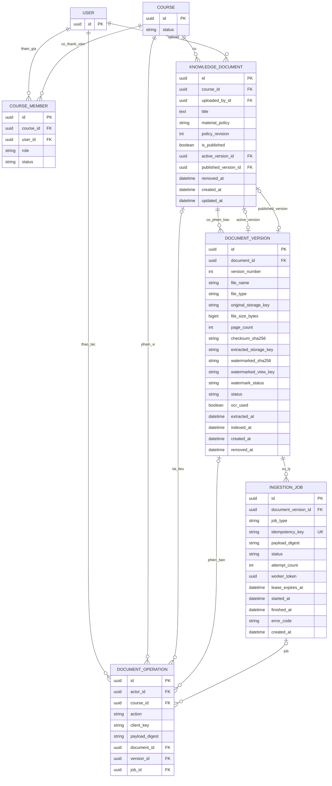

# Thiết kế dữ liệu học liệu — B1 ngày 07/10/2026

Trạng thái ngày 09/10: đã kiểm thử migration học liệu với users.User/courses.Course UUID nhánh A 0a0d63e và migration Classroom/Enrollment mới. JWT và quyền CourseMember dùng code A; không tạo model User/Course trùng trong app documents. Phần kiểm chứng hiện dùng SQLite local, chưa xác nhận PostgreSQL/production.

## Thuộc tính và ràng buộc

| Bảng | Ràng buộc/giá trị |
|---|---|
| KnowledgeDocument | course/uploaded_by bắt buộc; mặc định material_policy=PROTECTED, policy_revision=1, is_published=false. PUBLIC_DOWNLOAD chỉ đổi chính sách học liệu, không đổi quyền khóa học. active_version, removed_at được rỗng. |
| DocumentVersion | UNIQUE(document_id, version_number); version_number >= 1; file_size_bytes > 0; checksum là SHA-256 64 ký tự hex. Storage key riêng do server cấp, không là URL public. extraction/view/index timestamps/key được rỗng khi chưa xong. |
| IngestionJob | UNIQUE(idempotency_key), UUID hex do server cấp cho job. payload_digest là checksum nguồn; attempt_count >= 0; worker_token/lease kiểm soát worker muộn. |
| DocumentOperation | UNIQUE(actor, course, action, client_key). payload_digest băm nội dung thao tác/file; key cũ với payload khác trả 409. Liên kết document/version/job dùng để trả lại cùng kết quả thao tác. |

W2 upload chỉ PDF văn bản <=20 MiB và <=100 trang; enum định dạng của sản phẩm cuối có PDF/DOCX/PPTX/TXT, không có nghĩa API W2 nhận tất cả. Gốc sạch dùng extraction/RAG, derivative watermark dùng xem. Khi thay file giữ policy trên KnowledgeDocument.

## Trạng thái và điểm kích hoạt

- Version: QUEUED → PROCESSING → EXTRACTED → READY, hoặc FAILED/REMOVED. EXTRACTED là chờ phần chỉ mục/bản xem theo pipeline; không gọi EXTRACTED là READY cho AI. READY chỉ sau kiểm tra đủ yêu cầu phục vụ. Gỡ không quay lại READY.
- Job: QUEUED → RUNNING → SUCCEEDED/FAILED/CANCELLED; retry có token/lần thử và kiểm tra nguồn chưa gỡ. job_type: EXTRACT/INDEX/PREPARE_VIEW.
- watermark_status: NOT_STARTED/PROCESSING/READY/FAILED; protected viewer chỉ trả derivative READY. Không fallback bản sạch.
- API extraction_status được suy ra từ extracted_at và job EXTRACT hiện hành: NOT_STARTED/QUEUED/PROCESSING/EXTRACTED/FAILED. Không cần một trạng thái text tự do thứ ba trong DB.
- W2 kết quả standalone có extraction_status=EXTRACTED, indexed_at=null, rag_ready=false. Đã kiểm chứng DB runtime tạm với model A; chưa seed DB demo chung.
- active_version_id phải trỏ phiên bản thuộc cùng document, READY và có các kết quả cần thiết. Khi chưa index xong giữ rỗng hoặc giữ bản đang phục vụ trước đó; viewer chọn version đã chuẩn bị theo quyền và không tự quảng bá thành bản AI đang phục vụ.

## ERD sang migration

1. Tạo KnowledgeDocument với active_version nullable, tạo DocumentVersion/IngestionJob, sau đó thêm FK active_version nếu ORM cần tránh phụ thuộc vòng. Thay active trong transaction sau kiểm tra version cùng document.
2. FK User/Course dùng bảo toàn tham chiếu (PROTECT hoặc chính sách tương đương); gỡ học liệu soft delete, không cascade mất lịch sử. Các FK/index phải chốt theo ORM A đang dùng.
3. Index (course_id, removed_at, is_published), (document_id, version_number), (status, created_at) cho job; UNIQUE thực trong database, không chỉ kiểm tra bằng Python.
4. Worker claim job bằng transaction; kết quả ghi file tạm/thay thế nguyên tử rồi commit metadata. Worker token/lease và removed_at phải được kiểm tra trước ghi thành công. Timeout 900 giây phải có cơ chế dừng/phát hiện thật.
5. Upload idempotency gồm cả tạo tài liệu/phiên bản, không chỉ job. 08/10 cần thêm bảng/record thao tác upload hoặc ràng buộc tương đương ở service để một request lặp không tạo hai document trước khi enqueue.
6. Lưu UTC có múi giờ, hiển thị Asia/Saigon. Kiểm tra quyền dùng service A cung cấp; UserRole/Profile không tự cấp quyền học liệu.

## Hợp đồng đã chốt với A

- AUTH_USER_MODEL=users.User, Course=courses.Course, CourseMember lưu OWNER/STUDENT và trạng thái membership.
- JWT API: /api/users/login/, token/refresh/, session/, logout/. B không thêm endpoint auth khác.
- Provider quyền: apps.courses.permissions.can_manage_course/can_view_course; admin không tự có quyền học liệu riêng.
- Migration đã chạy trong test model A. Dữ liệu demo chung và kiểm chứng PostgreSQL còn cần phối hợp ngày tiếp theo.

## Cập nhật hiện thực B2

API tài liệu xác thực access token bằng JWT Bearer. Không dùng session/Basic fallback. Session/CSRF middleware chỉ được giữ để Django admin tiếp tục hoạt động.

Bổ sung bảng `DocumentOperation` lưu actor, course, action, client_key, payload_digest và liên kết document/version/job. Ràng buộc unique(actor, course, action, client_key) bảo đảm request lặp không tạo thêm học liệu/phiên bản; payload khác trả 409. IngestionJob vẫn lưu định danh và lease riêng cho worker.

Migration `documents.0001_initial` sử dụng `DOCUMENTS_COURSE_MODEL` và `AUTH_USER_MODEL`. Phải thống nhất Course model trước lần migrate đầu tiên, không đổi app/model sau khi đã triển khai database. Model Course/Membership trong `tests.document_support` chỉ phục vụ kiểm thử độc lập, không dùng trong production. Test tích hợp và script delivery chạy migration với model User/Course thực tế của A.

## Chốt tích hợp với A ngày 08/10

User UUID, Course UUID và CourseMember dùng nguyên bản nhánh A b8b03df. Course không có FK teacher trực tiếp: giáo viên sở hữu được xác định qua CourseMember(role=OWNER,status=ACTIVE). B dùng apps.courses.permissions.can_manage_course/can_view_course. Học viên cần STUDENT/ACTIVE và Course PUBLISHED. Migration documents đã kiểm thử với model/migration A thật; cấu hình bổ sung nằm ở config.settings.w2. Xem báo cáo w2-b-handoff-and-ab-decisions.md.

## Cập nhật ngày 09/10

Nhánh A 0a0d63e thêm AccessPolicy/Classroom/Enrollment/JoinRequest; học viên vào lớp bằng mã hoặc yêu cầu được duyệt. Enrollment đồng bộ quyền CourseMember. Rút khỏi lớp cuối hoặc thu hồi cả khóa chặn quyền học liệu; còn enrollment hiệu lực ở lớp khác cùng khóa thì vẫn được đọc. KnowledgeDocument tiếp tục FK trực tiếp Course nên các lớp cùng khóa dùng chung tài liệu; chưa thêm FK Classroom/Lesson. INVITED không còn là trạng thái CourseMember; chờ duyệt được biểu diễn bằng JoinRequest.PENDING và chưa có quyền đọc học liệu.

## Công bố và bản xem hoàn thiện ngày 09/10

Migration documents.0002 thêm published_version nullable và watermarked_sha256. published_version phải thuộc chính học liệu, còn hiệu lực, EXTRACTED/READY và có derivative watermark READY. Công bố không gán active_version/indexed_at hay rag_ready. Thay nguồn giữ published_version cũ; gỡ hoặc thu hồi công bố xóa tham chiếu này.

Worker EXTRACT tạo extraction và derivative có watermark trước khi chốt EXTRACTED; gốc sạch không bị sửa. Policy ở cấp KnowledgeDocument mặc định PROTECTED, revision bắt đầu 1; PUBLIC_DOWNLOAD giữ nguyên quyền Course. Policy update khóa document và kiểm tra revision, view/download kiểm tra checksum và không fallback nguồn sạch khi derivative thiếu/hỏng.
