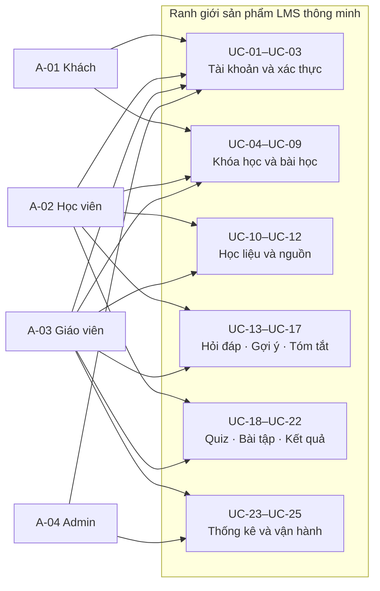

# Phân tích actors và use cases của hệ thống LMS thông minh

- **Đề tài:** Xây dựng hệ thống quản lý học tập thông minh tích hợp mô hình ngôn ngữ lớn tinh chỉnh và kỹ thuật RAG.
- **Sinh viên thực hiện:** Trần Tuấn Cường.
- **Hạng mục:** Phân tích actors và use cases.
- **Ngày cập nhật:** 01/10/2026.

## 1. Tổng quan bài toán

Trong quá trình học trực tuyến, học viên thường phải tự tìm lại thông tin trong nhiều tài liệu khi chưa hiểu một nội dung hoặc gặp khó khăn với bài tập. Giáo viên cũng cần tổ chức học liệu, theo dõi tiến độ và giải đáp những câu hỏi lặp lại. Từ bài toán này, nhóm xây dựng một hệ thống LMS kết hợp trợ lý AI sử dụng tài liệu của từng khóa học làm cơ sở trả lời.

Giáo viên tạo khóa học, tổ chức bài học và tải tài liệu lên hệ thống. Học viên tham gia khóa học để đọc tài liệu, làm quiz, nộp bài tập và sử dụng trợ lý AI. Trợ lý hỗ trợ ba nhu cầu chính: hỏi đáp tài liệu, gợi ý cách làm bài và tóm tắt nội dung. Khi cung cấp thông tin từ học liệu, hệ thống hiển thị nguồn để học viên có thể kiểm tra lại.

Mục tiêu của phần phân tích này là xác định các tác nhân sử dụng hệ thống, chức năng mà mỗi tác nhân cần thực hiện và điều kiện kiểm soát quyền truy cập. Kết quả được sử dụng để xây dựng yêu cầu chức năng, yêu cầu phi chức năng, xác định phạm vi MVP và thiết kế kiểm thử.

## 2. Phạm vi và ranh giới hệ thống

### 2.1. Ranh giới hệ thống

Hệ thống gồm giao diện web, dịch vụ nghiệp vụ LMS, cơ sở dữ liệu, bộ xử lý tài liệu và dịch vụ trợ lý AI. Các thành phần như LLM, bộ truy xuất, bộ tạo embedding và tiến trình xử lý tài liệu nằm bên trong hệ thống, vì vậy không được xem là actor độc lập.

Các actor của sản phẩm là khách chưa đăng nhập, học viên, giáo viên và quản trị viên. Cổng thanh toán chỉ tham gia nếu nhóm triển khai chức năng khóa học trả phí. Hoạt động chuẩn bị dữ liệu, huấn luyện và đánh giá mô hình thuộc môi trường nghiên cứu riêng, không phải chức năng dành cho học viên.

### 2.2. Phạm vi chức năng dự kiến

Nhóm tập trung vào các chức năng sau:

- Quản lý tài khoản và phân quyền theo vai trò.
- Quản lý khóa học, thành viên, bài học và tài liệu.
- Xử lý tài liệu để phục vụ truy xuất và lưu vị trí nguồn theo trang, slide hoặc mục nội dung.
- Hỏi đáp, gợi ý bài tập và tóm tắt dựa trên học liệu được phép truy cập.
- Quản lý quiz, bài tập, kết quả học tập và tiến độ.
- Cung cấp thống kê cơ bản cho giáo viên và quản trị viên.

Sản phẩm được xây dựng ở mức nguyên mẫu. Phần đánh giá nghiên cứu dự kiến sử dụng tài liệu của 2–3 môn học và bộ benchmark khoảng 300–800 câu hỏi chuẩn. Số môn học và số câu hỏi này xác định quy mô thí nghiệm, không phải giới hạn cố định của phần mềm.

Các chức năng thanh toán, thống kê doanh thu và video tương tác được xem xét mở rộng sau khi hoàn thành luồng học tập và trợ lý AI. Chế độ trả lời bằng kiến thức tổng quát ngoài học liệu cũng được tách khỏi luồng hỏi đáp theo khóa học.

### 2.3. Nguyên tắc hoạt động của trợ lý AI

Trợ lý sử dụng học liệu thuộc khóa học mà người dùng có quyền truy cập. Nếu chưa tìm thấy thông tin đủ để trả lời, hướng xử lý đề xuất là hỏi lại hoặc thông báo giới hạn của học liệu, thay vì tự động đưa ra câu trả lời bằng kiến thức ngoài khóa học.

Ba chức năng hỏi đáp, gợi ý và tóm tắt có thể dùng chung mô hình nhưng khác nhau về mục tiêu và luồng xử lý. Hỏi đáp cần tìm bằng chứng liên quan; gợi ý phải tuân theo chính sách của bài tập; tóm tắt cần bao phủ phạm vi nội dung được chọn.

Việc thêm tài liệu mới làm thay đổi kho tri thức và chỉ mục RAG. Huấn luyện QLoRA được thực hiện riêng để nghiên cứu khả năng cải thiện cách trả lời và hướng dẫn học tập. Nhóm đánh giá chất lượng bằng thí nghiệm và kiểm tra thủ công, không đặt mục tiêu loại bỏ hoàn toàn mọi câu trả lời sai.

## 3. Phân tích actors

### 3.1. Actors của sản phẩm

| Mã | Actor | Mục tiêu sử dụng | Phạm vi quyền |
|---|---|---|---|
| A-01 | Khách chưa đăng nhập | Tìm hiểu khóa học công khai và đăng nhập; đăng ký nếu hệ thống cho phép tự tạo tài khoản. | Xem thông tin giới thiệu công khai; chưa có quyền sử dụng học liệu hoặc trợ lý AI. |
| A-02 | Học viên | Tham gia khóa học, học bài, hỏi đáp, nhận gợi ý, tóm tắt, làm bài và theo dõi kết quả. | Khóa học được cấp quyền và dữ liệu học tập của chính mình. |
| A-03 | Giáo viên | Tạo khóa học, tổ chức học liệu, xây bài đánh giá, chấm bài và theo dõi lớp. | Khóa học do mình quản lý hoặc được phân công. |
| A-04 | Quản trị viên | Quản lý tài khoản, vai trò và theo dõi tình trạng sử dụng nền tảng. | Chức năng quản trị được cấp; quyền đọc nội dung riêng cần được xác định riêng. |
| X-01 | Cổng thanh toán | Xử lý giao dịch và cung cấp kết quả thanh toán khi triển khai khóa học trả phí. | API và thông báo giao dịch đã được xác thực. |

Một cá nhân có thể có nhiều vai trò. Tuy nhiên, quyền thực hiện thao tác phải được kiểm tra trên từng khóa học và đối tượng dữ liệu. Ví dụ, một giáo viên không được sửa tài liệu của khóa học do giáo viên khác quản lý chỉ vì có cùng vai trò giáo viên.

### 3.2. Actors trong môi trường nghiên cứu

| Mã | Actor | Trách nhiệm |
|---|---|---|
| R-01 | Thành viên nghiên cứu | Chuẩn bị dữ liệu, thực hiện huấn luyện, chạy benchmark và phân tích kết quả trong môi trường thí nghiệm. |
| R-02 | Người đánh giá học thuật | Kiểm tra một phần câu hỏi, đáp án và nguồn chuẩn; đánh giá chất lượng câu trả lời theo tiêu chí thống nhất. |

Hai vai trò nghiên cứu không yêu cầu tạo thêm nhóm quyền đăng nhập trong LMS. Giáo viên có thể tham gia đánh giá chất lượng học liệu hoặc câu trả lời khi được cung cấp bộ mẫu phù hợp.

## 4. Danh mục use cases của sản phẩm

Nhóm sử dụng hai mức ưu tiên để sắp xếp việc triển khai: **P0** cho các chức năng tạo thành luồng giáo viên tải tài liệu → học viên hỏi đáp có nguồn; **P1** cho các chức năng học tập và quản lý bổ sung. Những chức năng mở rộng được liệt kê riêng ở mục 10. Thứ tự này là cơ sở phân tích để lựa chọn MVP, chưa thay thế bước chốt phạm vi.

| Mã | Use case | Actor chính | Ưu tiên | Mục tiêu |
|---|---|---|---|---|
| UC-01 | Đăng ký tài khoản học viên | A-01 | P1 | Tự tạo tài khoản nếu áp dụng cơ chế đăng ký. |
| UC-02 | Đăng nhập và đăng xuất | A-01, A-02, A-03, A-04 | P0 | Xác thực và kết thúc phiên sử dụng. |
| UC-03 | Quản lý tài khoản và vai trò | A-04 | P0 | Cấp tài khoản, quản lý trạng thái và quyền. |
| UC-04 | Tạo và quản lý khóa học | A-03 | P0 | Tổ chức không gian học tập. |
| UC-05 | Tìm và xem giới thiệu khóa học | A-01, A-02 | P1 | Tìm hiểu khóa học công khai. |
| UC-06 | Tham gia khóa học | A-02 | P0 | Nhận quyền học theo điều kiện tham gia. |
| UC-07 | Quản lý thành viên khóa học | A-03 | P1 | Theo dõi và quản lý quyền của người học. |
| UC-08 | Tạo và quản lý bài học | A-03 | P1 | Tổ chức nội dung và thứ tự học. |
| UC-09 | Học bài và theo dõi tiến độ | A-02 | P1 | Học nội dung và xem mức độ hoàn thành. |
| UC-10 | Tải lên và quản lý tài liệu khóa học | A-03 | P0 | Bổ sung, thay thế hoặc gỡ học liệu. |
| UC-11 | Theo dõi xử lý tài liệu và yêu cầu thử lại | A-03 | P0 | Biết tài liệu đã có thể dùng với AI hay chưa. |
| UC-12 | Xem học liệu và mở nguồn trích dẫn | A-02, A-03 | P0 | Đọc tài liệu và kiểm chứng nguồn trả lời. |
| UC-13 | Hỏi đáp học liệu khóa học | A-02 | P0 | Giải đáp câu hỏi bằng thông tin trong học liệu. |
| UC-14 | Nhận gợi ý làm bài | A-02 | P1 | Hiểu hướng giải quyết trong mức trợ giúp được phép. |
| UC-15 | Tóm tắt học liệu | A-02 | P1 | Nắm ý chính của phạm vi nội dung đã chọn. |
| UC-16 | Xem lại lịch sử trợ lý AI | A-02 | P1 | Tiếp tục việc học từ các trao đổi trước, nếu bật lưu lịch sử. |
| UC-17 | Thiết lập phạm vi học liệu và chính sách trợ lý | A-03 | P1 | Kiểm soát nguồn và mức hỗ trợ của AI. |
| UC-18 | Tạo và quản lý quiz/bài tập | A-03 | P1 | Xây dựng hoạt động đánh giá kiến thức. |
| UC-19 | Làm quiz và nhận kết quả | A-02 | P1 | Hoàn thành quiz và xem kết quả được công bố. |
| UC-20 | Nộp bài tập | A-02 | P1 | Gửi bài tự luận hoặc file bài làm. |
| UC-21 | Chấm bài và phản hồi | A-03 | P1 | Đánh giá bài nộp và nhận xét cho học viên. |
| UC-22 | Xem điểm và phản hồi cá nhân | A-02 | P1 | Theo dõi kết quả của bản thân. |
| UC-23 | Xem thống kê học tập của khóa học | A-03 | P1 | Theo dõi tiến độ và phân bố kết quả của lớp. |
| UC-24 | Xem thống kê nền tảng | A-04 | P1 | Theo dõi người dùng, khóa học và hoạt động tổng hợp. |
| UC-25 | Giám sát dịch vụ AI và kiểm soát sử dụng | A-04 | P1 | Theo dõi lỗi, trạng thái và hạn mức sử dụng AI. |

UC-01 và UC-16 là các chức năng được xem xét bổ sung. Cơ chế tạo tài khoản và việc lưu lịch sử cần được xác định khi chốt MVP.

## 5. Ma trận quyền truy cập

| Nhóm hành động | Khách | Học viên | Giáo viên | Quản trị viên |
|---|---|---|---|---|
| Xem giới thiệu khóa học công khai | Có | Có | Có | Có |
| Tạo/sửa khóa học, bài học và tài liệu | Không | Không | Khóa học được quản lý | Cần quyền hỗ trợ nội dung riêng |
| Xem học liệu | Chưa được cấp quyền | Khóa học được cấp quyền | Khóa học được quản lý | Theo quyền nội dung cụ thể |
| Hỏi đáp, gợi ý và tóm tắt | Không | Học liệu được phép truy cập | Chức năng dùng thử đang được xem xét | Cần quyền sử dụng nội dung cụ thể |
| Làm quiz và nộp bài | Không | Bài được giao | Theo vai trò học viên nếu có | Theo vai trò học viên nếu có |
| Xem điểm | Không | Kết quả của bản thân | Kết quả trong lớp phụ trách | Theo quyền hỗ trợ được cấp |
| Chấm bài và xem thống kê lớp | Không | Không | Khóa học được quản lý | Cần quyền nghiệp vụ tương ứng |
| Xem lịch sử AI | Không | Lịch sử cá nhân nếu được lưu | Chưa cấp quyền xem lịch sử học viên | Chưa cấp quyền xem toàn bộ hội thoại |
| Quản lý tài khoản và vai trò | Không | Không | Không | Có |
| Xem thống kê nền tảng và vận hành | Không | Không | Thống kê khóa học phụ trách | Có theo quyền quản trị |

Việc kiểm tra quyền được thực hiện tại backend. Quyền truy cập phải áp dụng cả khi truy xuất tài liệu, mở nguồn trích dẫn, tải file, lấy lịch sử hoặc dùng kết quả đã lưu trong bộ nhớ đệm. Giao diện ẩn một chức năng không thay thế được việc kiểm tra quyền ở phía máy chủ.

## 6. Đặc tả use cases

Mỗi use case được mô tả qua mục tiêu, tiền điều kiện, luồng xử lý, ngoại lệ và hậu điều kiện. Cách trình bày này giúp xác định hành vi mong đợi của hệ thống và xây dựng các tình huống kiểm thử tương ứng.

### UC-01 Đăng ký tài khoản học viên

- **Actor / mục tiêu:** khách tạo tài khoản để tham gia học; áp dụng nếu nhóm chọn đăng ký tự phục vụ.
- **Tiền điều kiện / kích hoạt:** khách chưa đăng nhập, mở chức năng đăng ký.
- **Luồng chính:** nhập thông tin cần thiết → hệ thống kiểm tra tính hợp lệ và trùng định danh → tạo tài khoản học viên → thông báo cách đăng nhập.
- **Ngoại lệ:** thông tin không hợp lệ hoặc trùng định danh thì báo lỗi; yêu cầu đăng ký làm giáo viên/admin không tự được cấp quyền. Nếu dùng tài khoản cấp sẵn, use case này không thuộc MVP.
- **Hậu điều kiện:** tài khoản được tạo theo chính sách đăng ký; chưa có quyền học liệu của khóa học chỉ vì đã có tài khoản.

### UC-02 Đăng nhập và đăng xuất

- **Actor / mục tiêu:** người dùng xác thực để sử dụng chức năng theo vai trò.
- **Tiền điều kiện / kích hoạt:** có tài khoản hợp lệ; gửi thông tin đăng nhập hoặc chọn đăng xuất.
- **Luồng chính:** xác thực thông tin và trạng thái tài khoản → thiết lập phiên → hiển thị chức năng được phép; khi đăng xuất, kết thúc phiên tương ứng.
- **Ngoại lệ:** sai thông tin, tài khoản bị khóa hoặc phiên hết hạn thì từ chối và thông báo phù hợp; yêu cầu đã hết phiên phải xác thực lại.
- **Hậu điều kiện:** có phiên hợp lệ hoặc phiên đã kết thúc; không nâng quyền ngoài vai trò được cấp.

### UC-03 Quản lý tài khoản và vai trò

- **Actor / mục tiêu:** admin quản lý người dùng và quyền nền tảng.
- **Tiền điều kiện / kích hoạt:** phiên admin có quyền quản lý tài khoản; chọn tài khoản cần xử lý.
- **Luồng chính:** xem danh sách → tạo/cập nhật tài khoản, khóa/mở khóa hoặc gán vai trò theo chính sách → xác nhận thay đổi → lưu dấu vết tác nghiệp.
- **Ngoại lệ:** quyền không đủ, dữ liệu trùng hoặc thay đổi có nguy cơ mất tài khoản quản trị cuối cùng thì từ chối theo chính sách cần chốt. Xóa vĩnh viễn tài khoản chưa thuộc yêu cầu mặc định.
- **Hậu điều kiện:** quyền/trạng thái được cập nhật; phiên và quyền truy cập chịu ảnh hưởng phải được kiểm tra lại.

### UC-04 Tạo và quản lý khóa học

- **Actor / mục tiêu:** giáo viên tạo không gian học tập và kiểm soát việc công bố.
- **Tiền điều kiện / kích hoạt:** có vai trò giáo viên; chọn tạo khóa học hoặc chỉnh sửa khóa học được quản lý.
- **Luồng chính:** nhập tên, mô tả và thông tin khóa học → thiết lập khả năng hiển thị/tham gia → lưu → quản lý nội dung và công bố khi đủ điều kiện.
- **Ngoại lệ:** thiếu thông tin hoặc không có quyền sở hữu/phân công thì từ chối; thiết lập trả phí chuyển sang phạm vi mở rộng. Trạng thái nháp/công bố/lưu trữ là đề xuất cần chốt.
- **Hậu điều kiện:** khóa học có định danh và giáo viên chịu trách nhiệm; hiển thị theo trạng thái/quyền đã thiết lập.

### UC-05 Tìm và xem giới thiệu khóa học

- **Actor / mục tiêu:** khách/học viên tìm khóa học phù hợp.
- **Tiền điều kiện / kích hoạt:** có khóa học được công bố công khai; truy cập danh sách hoặc tìm kiếm.
- **Luồng chính:** nhập điều kiện tìm → nhận danh sách công khai → xem giới thiệu, giáo viên và điều kiện tham gia → chuyển sang đăng nhập/tham gia nếu cần.
- **Ngoại lệ:** không có kết quả thì thông báo; không hiển thị lớp riêng tư hoặc tài liệu riêng qua tìm kiếm công khai.
- **Hậu điều kiện:** người dùng hiểu điều kiện tham gia; việc xem giới thiệu chưa tạo quyền học.

### UC-06 Tham gia khóa học

- **Actor / mục tiêu:** học viên nhận quyền học khóa học.
- **Tiền điều kiện / kích hoạt:** đăng nhập, tài khoản hoạt động; chọn tham gia hoặc nhập thông tin lớp riêng tư nếu chức năng này được chọn.
- **Luồng chính:** hệ thống kiểm tra khóa học và điều kiện tham gia → kiểm tra mã/mật khẩu nếu là lớp riêng tư → tạo quan hệ tham gia → hiển thị nội dung được cấp quyền.
- **Ngoại lệ:** mã/mật khẩu sai, khóa học không mở, đã tham gia hoặc bị thu hồi quyền thì xử lý tương ứng; thao tác lặp không tạo nhiều quan hệ tham gia. Khóa trả phí cần UC-X01.
- **Hậu điều kiện:** học viên có quyền theo quan hệ tham gia hiện hành; không cấp quyền tới khóa học khác.

### UC-07 Quản lý thành viên khóa học

- **Actor / mục tiêu:** giáo viên kiểm soát danh sách người học trong khóa học phụ trách.
- **Tiền điều kiện / kích hoạt:** có quyền quản lý khóa học; mở danh sách thành viên.
- **Luồng chính:** xem thành viên → thêm/cấp quyền hoặc thu hồi quyền theo cơ chế được nhóm chốt → xác nhận → cập nhật danh sách và dấu vết.
- **Ngoại lệ:** sai khóa học, người dùng không hợp lệ hoặc không đủ quyền thì từ chối; chưa mặc định có quy trình duyệt yêu cầu tham gia.
- **Hậu điều kiện:** các lần truy cập nội dung/AI tiếp theo tuân thủ quyền mới; dữ liệu điểm và lượt nộp không bị xóa tùy tiện khi thu hồi quyền.

### UC-08 Tạo và quản lý bài học

- **Actor / mục tiêu:** giáo viên tổ chức nội dung học theo khóa học.
- **Tiền điều kiện / kích hoạt:** có quyền khóa học; tạo/sửa bài học.
- **Luồng chính:** nhập tiêu đề/nội dung → sắp xếp thứ tự → liên kết tài liệu và bài đánh giá → lưu/công bố theo trạng thái khóa học.
- **Ngoại lệ:** không đủ quyền, tài liệu liên kết không thuộc phạm vi được phép hoặc dữ liệu thiếu thì báo lỗi; video tương tác dùng UC-X03.
- **Hậu điều kiện:** bài học thuộc đúng khóa học, hiển thị theo quyền; cập nhật nội dung không mặc nhiên thay đổi điểm đã chấm.

### UC-09 Học bài và theo dõi tiến độ

- **Actor / mục tiêu:** học viên học nội dung và biết phần đã hoàn thành.
- **Tiền điều kiện / kích hoạt:** có quyền khóa học và bài học; mở bài học.
- **Luồng chính:** xem nội dung/học liệu → thực hiện hoạt động → hệ thống ghi tiến độ theo tiêu chí hoàn thành được chốt → hiển thị tiến độ cá nhân.
- **Ngoại lệ:** nội dung chưa công bố hoặc quyền bị thu hồi thì từ chối; mất kết nối không được tự coi là hoàn thành. Không mặc định mở trang là đã học xong.
- **Hậu điều kiện:** tiến độ gắn đúng học viên/bài học; được sử dụng trong UC-23.

### UC-10 Tải lên và quản lý tài liệu khóa học

- **Actor / mục tiêu:** giáo viên đưa học liệu vào khóa học để học viên và AI sử dụng.
- **Tiền điều kiện / kích hoạt:** có quyền khóa học, tài liệu có quyền sử dụng; chọn tải lên, thay thế hoặc gỡ tài liệu.
- **Luồng chính:** chọn file và khai báo metadata/phạm vi sử dụng → kiểm tra quyền, định dạng, kích thước → lưu bản tài liệu có định danh/phiên bản → tạo tác vụ xử lý → hiển thị trạng thái cho giáo viên.
- **Luồng thay thế/gỡ:** thay thế tạo phiên bản mới và xử lý lại; gỡ làm tài liệu ngừng phục vụ truy xuất theo chính sách. Không coi cập nhật file gốc là đã cập nhật chỉ mục.
- **Ngoại lệ:** file hỏng, định dạng chưa hỗ trợ, vượt giới hạn hoặc lỗi lưu thì báo lỗi; không đưa tài liệu chưa xử lý thành công vào phạm vi trả lời. Cách chuyển phiên bản đang phục vụ cần chốt.
- **Hậu điều kiện:** tài liệu thuộc đúng khóa học; lưu nguồn và phiên bản. Tài liệu đã gỡ hoặc đáp án riêng của giáo viên không được tiếp tục xuất hiện trong context của học viên.

### UC-11 Theo dõi xử lý tài liệu và yêu cầu thử lại

- **Actor / mục tiêu:** giáo viên biết tài liệu đã có thể dùng với AI hay chưa.
- **Tiền điều kiện / kích hoạt:** tài liệu đã tải lên; mở trạng thái xử lý.
- **Luồng chính:** xem trạng thái → pipeline trích xuất, OCR khi cần, chia đoạn, lưu vị trí nguồn, tạo embedding/chỉ mục → giáo viên nhận trạng thái sẵn sàng hoặc lỗi; nếu lỗi có thể yêu cầu thử lại.
- **Ngoại lệ:** trích xuất rỗng, OCR không đủ chất lượng hoặc worker bị ngắt thì giữ trạng thái chưa sẵn sàng và nguyên nhân phù hợp; thử lại không tạo chunk trùng hoặc chỉ mục sai phiên bản.
- **Hậu điều kiện:** chỉ tài liệu/phiên bản hợp lệ, xử lý thành công được phục vụ retrieval. Các trạng thái đề xuất: chờ xử lý, đang xử lý, sẵn sàng, lỗi, đã gỡ.

### UC-12 Xem học liệu và mở nguồn trích dẫn

- **Actor / mục tiêu:** học viên/giáo viên đọc nội dung và kiểm chứng câu trả lời AI.
- **Tiền điều kiện / kích hoạt:** có quyền đọc tài liệu cụ thể; chọn học liệu hoặc citation.
- **Luồng chính:** kiểm tra quyền hiện tại → xác định tài liệu/phiên bản và trang, slide hoặc section → mở vị trí nguồn hoặc cung cấp chỉ dẫn vị trí nếu viewer chưa hỗ trợ nhảy trực tiếp.
- **Ngoại lệ:** nguồn đã gỡ, phiên bản không còn phục vụ hoặc quyền bị thu hồi thì báo không khả dụng; không tạo citation hoặc số trang giả. DOC/DOCX cần vị trí section hoặc bản chuẩn hóa nếu số trang chưa ổn định.
- **Hậu điều kiện:** người dùng xem được đúng nguồn được phép; không dùng link citation để vượt quyền.

### UC-13 Hỏi đáp học liệu khóa học

- **Actor / mục tiêu:** học viên giải đáp câu hỏi bằng tài liệu khóa học đang học.
- **Tiền điều kiện:** đăng nhập, có quyền khóa học và nguồn được phép; dịch vụ AI và ít nhất một tài liệu liên quan sẵn sàng.
- **Kích hoạt:** mở trợ lý trong khóa học, chọn hỏi đáp và gửi câu hỏi.
- **Luồng chính:**
  1. Backend kiểm tra tài khoản, quyền khóa học, giới hạn sử dụng và chế độ.
  2. Xác định phạm vi học liệu được phép; không dùng `course_id` từ client làm căn cứ duy nhất.
  3. Truy xuất các đoạn phù hợp trong phạm vi này, thực hiện fusion/rerank nếu cấu hình thí nghiệm yêu cầu.
  4. Đánh giá mức đủ bằng chứng theo quy tắc đã hiệu chỉnh; tạo câu trả lời và nguồn tham chiếu từ context hợp lệ.
  5. Kiểm tra nguồn tham chiếu tồn tại, được phép và đúng phiên bản; hiển thị câu trả lời cùng vị trí nguồn.
  6. Lưu thông tin cần thiết cho lịch sử/đo lường nếu chính sách cho phép.
- **Thay thế / ngoại lệ:** câu hỏi mơ hồ → hỏi lại; thiếu nguồn hoặc ngoài phạm vi → thông báo chưa đủ học liệu, không tự fallback tổng quát theo giả định MVP; tài liệu đang xử lý → thông báo trạng thái; model timeout/không khả dụng → trả lỗi có thể thử lại; prompt injection → không được thay đổi quyền hoặc chính sách hệ thống.
- **Hậu điều kiện:** trả câu trả lời có nguồn hoặc thông báo giới hạn rõ ràng; không lộ tài liệu khóa học khác. Kiểm tra ID nguồn hợp lệ chưa đủ chứng minh nguồn hỗ trợ mọi nhận định, nên phải đánh giá citation accuracy riêng.

### UC-14 Nhận gợi ý làm bài

- **Actor / mục tiêu:** học viên hiểu hướng làm mà vẫn tự thực hiện bài tập.
- **Tiền điều kiện:** có quyền khóa học/bài tập và học liệu; chính sách trợ giúp theo bài và trạng thái làm bài đã được xác định.
- **Kích hoạt:** chọn gợi ý, gửi đề bài hoặc mở bài được giao và trình bày bước đã làm.
- **Luồng chính:**
  1. Kiểm tra quyền và lấy trạng thái bài từ backend nếu là bài trong LMS.
  2. Xác định mức trợ giúp giáo viên cho phép; chỉ truy xuất học liệu phù hợp, loại đáp án/rubric riêng của giáo viên.
  3. Nếu thiếu đề hoặc cách làm, yêu cầu bổ sung.
  4. Gợi nhắc khái niệm, chỉ ra bước cần xem xét hoặc đặt câu hỏi dẫn dắt; dẫn nguồn cho kiến thức sử dụng.
  5. Cho học viên tiếp tục hỏi theo chính sách hiện hành; không tự nộp hoặc chấm điểm chính thức thay học viên/giáo viên.
- **Thay thế / ngoại lệ:** yêu cầu đáp án trực tiếp → xử lý theo chính sách; bài kiểm tra đang diễn ra → từ chối hoặc chỉ hỗ trợ mức được phép; không xác định được trạng thái bài → không suy đoán rằng bài cho phép giải toàn bộ; thiếu học liệu/AI lỗi → thông báo phù hợp.
- **Hậu điều kiện:** học viên nhận trợ giúp được phép; đáp án bảo vệ không bị đưa vào context. Giới hạn giữa gợi ý và lời giải cần rubric kiểm thử, không bảo đảm chỉ bằng prompt.

### UC-15 Tóm tắt học liệu

- **Actor / mục tiêu:** học viên nắm ý chính của tài liệu, chương hoặc phần học được chọn.
- **Tiền điều kiện:** có quyền toàn bộ phạm vi yêu cầu; các nguồn trong phạm vi sẵn sàng hoặc hệ thống thông báo rõ phần chưa sẵn sàng.
- **Kích hoạt:** chọn tài liệu/section/bài học/phạm vi khóa học và yêu cầu tóm tắt.
- **Luồng chính:** xác định toàn bộ nội dung được chọn → kiểm tra độ bao phủ → xử lý từng phần nếu dài → tổng hợp các ý chính → gắn nguồn phù hợp → hiển thị phạm vi đã tóm tắt và phần thiếu nếu có.
- **Thay thế / ngoại lệ:** không có nguồn, quyền không đủ, nguồn chưa xử lý hoặc context vượt giới hạn → yêu cầu thu hẹp/chia phần hoặc báo chưa thể hoàn thành; nguồn thay đổi trong khi xử lý → xác định phiên bản sử dụng và xử lý theo chính sách nhất quán.
- **Hậu điều kiện:** bản tóm tắt không bị trình bày như bao phủ toàn bộ nếu mới xử lý một phần; không chỉ lấy vài chunk gần câu hỏi để thay cho tóm tắt cả tài liệu.

### UC-16 Xem lại lịch sử trợ lý AI

- **Actor / mục tiêu:** học viên tiếp tục việc học từ hội thoại trước; chức năng này được xem xét để hỗ trợ việc học liên tục.
- **Tiền điều kiện / kích hoạt:** chính sách cho phép lưu hội thoại; mở lịch sử cá nhân.
- **Luồng chính:** liệt kê hội thoại theo tài khoản/khóa học → kiểm tra quyền hiện tại → mở nội dung và nguồn còn được phép → tiếp tục yêu cầu mới với quyền hiện hành.
- **Ngoại lệ:** hội thoại thuộc người khác, quyền khóa học bị thu hồi hoặc citation đã gỡ thì chặn/ẩn nội dung theo chính sách. Lịch sử và cache không được trở thành đường truy cập vòng qua phân quyền.
- **Hậu điều kiện:** chỉ hiển thị dữ liệu được phép; thời hạn lưu, xóa lịch sử và quyền giáo viên/admin xem hội thoại cần quyết định riêng.

### UC-17 Thiết lập phạm vi học liệu và chính sách trợ lý

- **Actor / mục tiêu:** giáo viên kiểm soát nguồn AI sử dụng và mức trợ giúp trong khóa học.
- **Tiền điều kiện / kích hoạt:** có quyền quản lý khóa học; mở thiết lập trợ lý.
- **Luồng chính:** chọn tài liệu cho học viên/AI sử dụng → phân biệt học liệu và tài liệu riêng/đáp án → đặt chính sách gợi ý theo bài hoặc khóa học → lưu cấu hình và phiên bản chính sách.
- **Ngoại lệ:** cấu hình tham chiếu tài liệu ngoài quyền hoặc mở đáp án riêng cho học viên không hợp lệ thì từ chối/cảnh báo theo quy trình cần chốt. Cấu hình giáo viên không được bỏ qua phân quyền nền tảng.
- **Hậu điều kiện:** UC-13/UC-14/UC-15 áp dụng chính sách hiện hành; thay đổi tài liệu không yêu cầu fine-tune lại LLM cho từng khóa học.

### UC-18 Tạo và quản lý quiz/bài tập

- **Actor / mục tiêu:** giáo viên tạo hoạt động đánh giá kiến thức.
- **Tiền điều kiện / kích hoạt:** có quyền khóa học/bài học; tạo hoặc sửa bài đánh giá.
- **Luồng chính:** nhập đề/câu hỏi, dạng bài và tiêu chí chấm → cấu hình thời gian, hạn nộp, số lượt và trợ giúp AI nếu áp dụng → lưu đáp án/rubric ở phạm vi riêng → công bố cho học viên được giao.
- **Ngoại lệ:** thiếu đáp án cho quiz tự chấm, thời gian không hợp lệ hoặc không đủ quyền thì báo lỗi; sửa bài đã có lượt làm cần chính sách bảo toàn phiên bản.
- **Hậu điều kiện:** bài đánh giá có phạm vi giao rõ; đề học viên xem được tách khỏi đáp án/rubric bảo vệ.

### UC-19 Làm quiz và nhận kết quả

- **Actor / mục tiêu:** học viên hoàn thành quiz được giao.
- **Tiền điều kiện / kích hoạt:** có quyền, còn thời gian và lượt làm; bắt đầu quiz.
- **Luồng chính:** kiểm tra điều kiện → tạo lượt làm gắn phiên bản đề → trả câu hỏi không kèm đáp án bảo vệ → ghi câu trả lời → nộp bài → backend kiểm tra thời gian và tự chấm theo đáp án → trả kết quả được phép công bố.
- **Ngoại lệ:** hết thời gian, mất kết nối, nộp lặp hoặc vượt lượt thì áp dụng quy tắc cần chốt; đồng hồ client không quyết định hạn. AI gợi ý phải tuân thủ chính sách của lượt làm.
- **Hậu điều kiện:** lượt làm và điểm được lưu nhất quán; thời điểm công bố đáp án/lời giải là quyết định riêng.

### UC-20 Nộp bài tập

- **Actor / mục tiêu:** học viên gửi bài tự luận hoặc file theo yêu cầu.
- **Tiền điều kiện / kích hoạt:** có quyền và bài còn nhận nộp; chọn nộp bài.
- **Luồng chính:** nhập nội dung/chọn file → kiểm tra định dạng, kích thước và hạn tại backend → lưu lượt nộp và thời điểm → xác nhận đã nhận bài.
- **Ngoại lệ:** file lỗi, vượt giới hạn hoặc hết hạn thì báo rõ; nộp lại/nộp muộn chỉ theo chính sách; thao tác lặp không tạo kết quả mâu thuẫn.
- **Hậu điều kiện:** lượt nộp gắn đúng học viên/bài/phiên bản; chưa có điểm chính thức nếu chờ giáo viên chấm.

### UC-21 Chấm bài và phản hồi

- **Actor / mục tiêu:** giáo viên đánh giá bài nộp trong khóa học phụ trách.
- **Tiền điều kiện / kích hoạt:** có quyền chấm và lượt nộp; mở bài cần chấm.
- **Luồng chính:** đọc bài → đối chiếu rubric → nhập điểm/nhận xét → lưu → công bố theo chính sách.
- **Ngoại lệ:** sai quyền, điểm ngoài thang hoặc cập nhật xung đột thì báo lỗi; sửa điểm cần dấu vết và quy tắc riêng. AI chấm tự luận chính thức chưa được yêu cầu.
- **Hậu điều kiện:** điểm và phản hồi thuộc đúng lượt nộp; học viên chỉ xem khi được công bố.

### UC-22 Xem điểm và phản hồi cá nhân

- **Actor / mục tiêu:** học viên biết kết quả học tập của mình.
- **Tiền điều kiện / kích hoạt:** phiên hợp lệ; mở kết quả.
- **Luồng chính:** kiểm tra quyền và chủ thể dữ liệu → lấy điểm/lượt nộp/nhận xét đã công bố → hiển thị lịch sử cá nhân.
- **Ngoại lệ:** chưa chấm hoặc chưa công bố thì hiển thị trạng thái; đổi định danh trong yêu cầu không cho phép xem điểm người khác. Chính sách xem kết quả sau khi rời lớp cần chốt.
- **Hậu điều kiện:** không tiết lộ điểm, bài nộp hoặc nhận xét của học viên khác.

### UC-23 Xem thống kê học tập của khóa học

- **Actor / mục tiêu:** giáo viên theo dõi tiến độ và kết quả lớp phụ trách.
- **Tiền điều kiện / kích hoạt:** có quyền thống kê khóa học; mở báo cáo và chọn phạm vi.
- **Luồng chính:** chọn khóa học/bài/thời gian → tổng hợp tiến độ, lượt nộp và phân bố điểm → xem số liệu và phạm vi tính toán.
- **Ngoại lệ:** chưa có hoạt động thì hiển thị dữ liệu rỗng; người chưa có điểm không được tự coi là điểm 0; không có quyền thì từ chối.
- **Hậu điều kiện:** số liệu có định nghĩa thống nhất với UC-09/UC-19/UC-20/UC-21. Không đưa doanh thu vào báo cáo MVP.

### UC-24 Xem thống kê nền tảng

- **Actor / mục tiêu:** admin theo dõi tình trạng sử dụng chung.
- **Tiền điều kiện / kích hoạt:** có quyền quản trị thống kê; mở dashboard.
- **Luồng chính:** chọn phạm vi → xem tổng người dùng, khóa học và hoạt động ở mức tổng hợp → kiểm tra thời điểm cập nhật.
- **Ngoại lệ:** không đủ quyền hoặc lỗi tổng hợp thì báo phù hợp; quyền xem số liệu tổng hợp không tự cấp quyền đọc hội thoại/tài liệu riêng.
- **Hậu điều kiện:** admin có số liệu phục vụ vận hành; doanh thu chỉ bổ sung khi thực hiện UC-X01/UC-X02.

### UC-25 Giám sát dịch vụ AI và kiểm soát sử dụng

- **Actor / mục tiêu:** admin hoặc người vận hành được cấp quyền biết tình trạng AI và kiểm soát tài nguyên.
- **Tiền điều kiện / kích hoạt:** có quyền vận hành được chốt; mở trạng thái/log hoặc cấu hình hạn mức.
- **Luồng chính:** xem tình trạng xử lý tài liệu, lỗi, số yêu cầu và độ trễ → cấu hình quota theo chính sách → kiểm tra hiệu lực → lưu dấu vết thay đổi.
- **Ngoại lệ:** AI/worker ngắt, vượt quota hoặc timeout thì trả trạng thái/lỗi có thể hiểu được; không coi lỗi AI là lỗi toàn bộ LMS. Log vận hành không mặc định chứa toàn văn học liệu/hội thoại.
- **Hậu điều kiện:** giới hạn được áp dụng ở backend; người dùng biết khi AI không khả dụng. Không mặc định có SLA hoặc cơ chế GPU dự phòng.

## 7. Quan hệ và sơ đồ use cases

### 7.1. Cách sử dụng include và extend

Các kiểm tra bắt buộc được ký hiệu **SV** để phân biệt dịch vụ dùng chung với mục tiêu độc lập của actor. Chúng không được tính thêm thành chức năng giao diện.

| Mã | Hành vi dùng chung | Use case sử dụng |
|---|---|---|
| SV-01 | Kiểm tra quyền theo người dùng, khóa học và đối tượng | UC-04, UC-06–UC-25 khi áp dụng. |
| SV-02 | Xác định học liệu và phiên bản được phép | UC-12–UC-15, UC-17. |
| SV-03 | Truy xuất bằng chứng liên quan | UC-13; UC-14 khi cung cấp hướng dẫn dựa trên nguồn. |
| SV-04 | Tạo và kiểm tra tham chiếu nguồn | Câu trả lời có nguồn của UC-13, UC-14, UC-15. |

- UC-13 **include** SV-01, SV-02, SV-03; nhánh trả lời dựa trên nguồn thực hiện SV-04.
- UC-14 **include** SV-01, SV-02 và kiểm tra chính sách bài tập; không mặc định include UC-13 vì mục tiêu và cách trả lời khác nhau.
- UC-15 **include** SV-01, SV-02 và bước xác định độ bao phủ. Không mặc định dùng SV-03 top-k như hỏi đáp.
- UC-12 có thể **extend** UC-13/UC-14/UC-15 tại điểm người dùng chọn citation trong kết quả có nguồn. Đây là hành động tùy chọn, không bắt buộc mọi lần trả lời.
- UC-11 tiếp nối UC-10 qua xử lý nền; không dùng `include` để ngụ ý upload phải chờ ingestion hoàn thành.
- UC-02 thường là tiền điều kiện của use case được bảo vệ, không phải `include` buộc người dùng đăng nhập lại mỗi lần.
- Từ chối vì thiếu bằng chứng, quá hạn hoặc thiếu quyền là nhánh thay thế/ngoại lệ, không phải actor hay use case độc lập.

### 7.2. Sơ đồ nhóm chức năng

Sơ đồ dưới đây thể hiện các nhóm chức năng mà từng actor tham gia. Quan hệ `include` và `extend` được phân tích riêng ở mục 7.1.

Mỗi liên kết tới nhóm chỉ thể hiện actor tham gia một số use case trong nhóm, không cấp toàn bộ quyền của nhóm. Ma trận mục 5 và đặc tả mục 6 là căn cứ quyền chi tiết.

## 8. Use cases trong môi trường nghiên cứu

Bên cạnh sản phẩm LMS, nhóm thực hiện thí nghiệm để đánh giá khi nào RAG và QLoRA cải thiện chất lượng trợ lý học tập. Các use case dưới đây mô tả hoạt động với công cụ nghiên cứu; học viên không trực tiếp sử dụng các chức năng này trên giao diện LMS.

| Mã | Use case | Actor | Hoạt động chính và kết quả | Điều kiện kiểm soát |
|---|---|---|---|---|
| UC-R01 | Xây dựng và quản lý corpus/QA benchmark | R-01, R-02 | Thu thập tài liệu có quyền sử dụng, làm sạch, xây câu hỏi/đáp án/nguồn chuẩn, kiểm tra mẫu và quản lý phiên bản dữ liệu. | Tách dữ liệu huấn luyện, validation và test; rà soát trùng lặp; không dùng đáp án test để huấn luyện hoặc chọn cấu hình. |
| UC-R02 | Huấn luyện và quản lý adapter QLoRA | R-01 | Chọn mô hình phù hợp tài nguyên, chạy thử, huấn luyện bằng instruction dataset và lưu adapter, checkpoint, cấu hình, log. | Có phương án tiếp tục khi runtime bị ngắt; không fine-tune lại mặc định khi giáo viên thêm tài liệu. |
| UC-R03 | Chạy benchmark và so sánh cấu hình | R-01 | So sánh Base LLM, RAG và QLoRA+RAG; khảo sát dense/hybrid/rerank; lưu câu trả lời, context, citation và kết quả đo. | Dùng cùng bộ đánh giá và giữ các yếu tố không khảo sát nhất quán; ghi nhận cả lượt lỗi và cấu hình model chấm. |
| UC-R04 | Đánh giá thủ công và phân tích lỗi | R-02, R-01 | Kiểm tra câu trả lời theo rubric, đối chiếu nguồn, phân loại lỗi và tổng hợp báo cáo kết quả. | Đánh giá riêng câu hỏi ngoài phạm vi, từ chối và prompt injection; kết hợp metric tự động với kiểm tra thủ công. |

Các chỉ số dự kiến gồm Recall@k, MRR hoặc nDCG cho truy xuất; correctness, faithfulness và context precision cho câu trả lời; citation accuracy cho nguồn; latency và mức sử dụng tài nguyên cho hiệu năng. Với phần mềm LMS, nhóm đánh giá khả năng hoàn thành tác vụ và các trường hợp kiểm thử nghiệp vụ.

Tài liệu trong tập kiểm thử có thể được đưa vào chỉ mục RAG để hệ thống trả lời theo điều kiện thí nghiệm. Tuy nhiên, nhãn và đáp án chuẩn của tập test không được sử dụng để huấn luyện hoặc điều chỉnh cấu hình. Toàn bộ phiên bản corpus, model, adapter, prompt và kết quả cần được lưu để tái lập thí nghiệm.

## 9. Quy tắc nghiệp vụ và kịch bản kiểm thử

### 9.1. Quy tắc nghiệp vụ

| Mã | Quy tắc | Use cases liên quan |
|---|---|---|
| BR-01 | Kiểm tra quyền theo tài khoản, khóa học và đối tượng tại backend. | UC-04–UC-25 |
| BR-02 | Trợ lý chỉ sử dụng học liệu mà người dùng có quyền truy cập, ở cả ba chế độ. | UC-12–UC-17 |
| BR-03 | Chỉ sử dụng phiên bản tài liệu đã xử lý thành công; không tiếp tục truy xuất tài liệu đã gỡ. Thử lại không tạo chunk trùng. | UC-10–UC-15 |
| BR-04 | Trích dẫn phải xác định được tài liệu và vị trí thực; không tạo tên tài liệu hoặc số trang giả. | UC-12–UC-15, UC-R03–UC-R04 |
| BR-05 | Với chế độ học liệu, khi thiếu bằng chứng thì hỏi lại hoặc thông báo chưa đủ thông tin. | UC-13–UC-14 |
| BR-06 | Gợi ý tuân theo chính sách và trạng thái bài tập; đáp án/rubric riêng không được đưa vào context của học viên. | UC-14, UC-17–UC-19 |
| BR-07 | Tóm tắt phải xác định phạm vi và thông báo phần chưa được xử lý nếu chưa đủ độ bao phủ. | UC-15 |
| BR-08 | Backend kiểm soát thời gian, hạn nộp và số lượt làm; công bố điểm/đáp án theo chính sách bài đánh giá. | UC-18–UC-22 |
| BR-09 | Học viên xem dữ liệu cá nhân; giáo viên xem lớp phụ trách. Lịch sử, cache và log phải tuân thủ quyền tương ứng. | UC-16, UC-21–UC-25 |
| BR-10 | Thêm học liệu cập nhật kho tri thức RAG; huấn luyện QLoRA được thực hiện trong quy trình nghiên cứu riêng. | UC-10–UC-11, UC-R02 |
| BR-11 | Dữ liệu và cấu hình thí nghiệm phải có phiên bản để truy vết kết quả. | UC-R01–UC-R04 |
| BR-12 | Khi AI hoặc tiến trình xử lý tài liệu gặp lỗi, hệ thống hiển thị trạng thái đúng và cho phép thử lại khi phù hợp. | UC-11, UC-13–UC-15, UC-25 |

### 9.2. Kịch bản kiểm thử trọng yếu

| Mã | Tình huống | Kết quả mong đợi | Use cases và quy tắc liên quan |
|---|---|---|---|
| AC-01 | Giáo viên tạo khóa học và tải tài liệu; học viên được cấp quyền đặt câu hỏi có đáp án trong tài liệu. | Sau khi xử lý thành công, trợ lý trả lời kèm nguồn mà học viên có thể mở. | UC-04, UC-06, UC-10–UC-13 |
| AC-02 | Học viên có quyền khóa A thay mã khóa học trong request hoặc mở citation/file của khóa B. | Từ chối truy cập; không trả nội dung, context hoặc cache của khóa B. | BR-01–BR-02; UC-12–UC-16 |
| AC-03 | Câu hỏi thiếu bằng chứng hoặc tài liệu chưa xử lý xong. | Thông báo giới hạn/trạng thái; không bịa câu trả lời hoặc nguồn. | BR-03–BR-05; UC-11, UC-13 |
| AC-04 | Giáo viên thay thế/gỡ tài liệu rồi học viên hỏi lại hoặc mở nguồn cũ. | Không sử dụng nguồn đã ngừng phục vụ; citation cũ được xử lý theo chính sách phiên bản. | UC-10–UC-13; BR-03–BR-04 |
| AC-05 | Học viên xin đáp án bài hạn chế trợ giúp, giả danh giáo viên hoặc đưa chỉ dẫn nhằm bỏ qua quy tắc. | Chỉ gợi ý hoặc từ chối theo chính sách; không tiết lộ đáp án riêng. | UC-14, UC-17–UC-19; BR-06 |
| AC-06 | Tóm tắt tài liệu dài có các ý quan trọng ở đầu, giữa và cuối. | Kiểm tra được độ bao phủ; thông báo rõ nếu chỉ xử lý một phần. | UC-15; BR-07 |
| AC-07 | Worker hoặc LLM bị ngắt trong quá trình xử lý. | Hiển thị lỗi/trạng thái phù hợp; thử lại không tạo dữ liệu trùng; chức năng LMS không phụ thuộc AI vẫn hoạt động. | UC-11, UC-25; BR-12 |
| AC-08 | Xem điểm người khác, sửa bài của lớp không phụ trách hoặc nộp quiz lặp. | Chặn truy cập sai quyền; lưu lượt nộp nhất quán. | UC-18–UC-23; BR-01, BR-08–BR-09 |
| AC-09 | Chạy lại thí nghiệm với cùng phiên bản dữ liệu và cấu hình. | Truy vết được câu trả lời, context, citation và kết quả đo; không dùng nhãn test để fine-tune. | UC-R01–UC-R04; BR-11 |

Các kịch bản trên xác định hành vi cần kiểm tra. Ngưỡng chất lượng AI, độ trễ, giới hạn file và quota sẽ được xác định trong phần yêu cầu phi chức năng và kế hoạch đánh giá sau khi có kết quả thử nghiệm ban đầu.

## 10. Use cases mở rộng

Nhóm xem xét các chức năng sau khi hoàn thành các nghiệp vụ học tập và trợ lý theo khóa học. Các chức năng này được tách riêng để tránh làm tăng phạm vi triển khai ban đầu.

| Mã | Use case | Actor | Luồng chính dự kiến | Điểm cần lưu ý |
|---|---|---|---|---|
| UC-X01 | Thanh toán để tham gia khóa học | A-02, X-01 | Tạo đơn, thực hiện thanh toán, xác thực kết quả phía máy chủ và cấp quyền khi giao dịch thành công. | Xử lý giao dịch chờ/thất bại, thông báo lặp và hoàn tiền; không cấp quyền chỉ dựa vào thông báo phía trình duyệt. |
| UC-X02 | Xem doanh thu và lịch sử giao dịch | A-02, A-03, A-04 | Học viên xem giao dịch cá nhân; giáo viên xem doanh thu của mình; quản trị viên xem tổng hợp. | Thống nhất trạng thái giao dịch, cách tính doanh thu và phạm vi quyền. |
| UC-X03 | Học qua video tương tác | A-02, A-03 | Giáo viên đặt mốc câu hỏi; học viên xem video, trả lời và nhận gợi ý hoặc xem lại đoạn liên quan. | Xác định cách cung cấp video, ghi tiến độ và áp dụng chính sách trợ giúp. |
| UC-X04 | Hỏi kiến thức tổng quát ngoài học liệu | A-02 | Người dùng chọn chế độ riêng và nhận câu trả lời có thông báo rằng chưa được xác nhận bằng tài liệu khóa học. | Không tự bật khi thiếu nguồn; vẫn áp dụng quyền và chính sách bài tập. |

## 11. Những nội dung cần làm rõ khi hoàn thiện SRS

Qua phân tích, nhóm nhận thấy một số quyết định nghiệp vụ cần được thống nhất trước khi triển khai chi tiết:

| Nội dung | Hướng xem xét | Use cases chịu ảnh hưởng |
|---|---|---|
| Cấp tài khoản | Chọn tài khoản cấp sẵn hoặc tự đăng ký học viên; vai trò giáo viên/admin phải có quy trình cấp quyền. | UC-01–UC-03 |
| Tham gia khóa học | Xác định lớp công khai, lớp riêng tư dùng mã/mật khẩu và cách giáo viên quản lý thành viên. | UC-04–UC-07 |
| Giới hạn trợ giúp | Xác định mức gợi ý cho bài luyện tập, bài có chấm điểm và bài kiểm tra đang diễn ra. | UC-14, UC-17–UC-19 |
| Định dạng tài liệu | Chọn các định dạng PDF, PPT/PPTX, DOC/DOCX, TXT được hỗ trợ ban đầu; xác định giới hạn file và trường hợp cần OCR. | UC-10–UC-12 |
| Thay thế tài liệu | Chọn cách phục vụ bản cũ trong lúc xử lý bản mới và xử lý citation của tài liệu đã gỡ. | UC-10–UC-16 |
| Lịch sử hội thoại | Xác định có lưu lịch sử hay không, thời gian lưu, quyền xem và cách xử lý khi mất quyền khóa học. | UC-13–UC-16, UC-25 |
| Tiến độ và kết quả | Xác định tiêu chí hoàn thành bài, lượt làm, nộp muộn và thời điểm công bố điểm/đáp án. | UC-09, UC-18–UC-23 |
| Quyền hỗ trợ quản trị | Xác định quyền xem nội dung riêng, điểm và hội thoại; cân nhắc chức năng giáo viên dùng thử trợ lý trước công bố. | UC-12–UC-17, UC-22–UC-25 |
| Hạ tầng và hạn mức AI | Thử nghiệm bằng Colab Free T4; xác định nơi chạy inference khi tích hợp web, quota và cách xử lý khi dịch vụ ngắt. | UC-11, UC-13–UC-15, UC-25, UC-R02–UC-R03 |
| Ngưỡng đánh giá | Dùng dữ liệu pilot/validation để xác định cấu hình, ngưỡng và tiêu chí chấp nhận; giữ tập test độc lập. | UC-R01–UC-R04 |

Việc ghi nhận các nội dung này giúp nhóm phân biệt chức năng đã phân tích với những chính sách còn cần lựa chọn. Phạm vi MVP sẽ được xác định dựa trên nhu cầu sử dụng, thời gian thực hiện và kết quả kiểm chứng khả năng triển khai.

